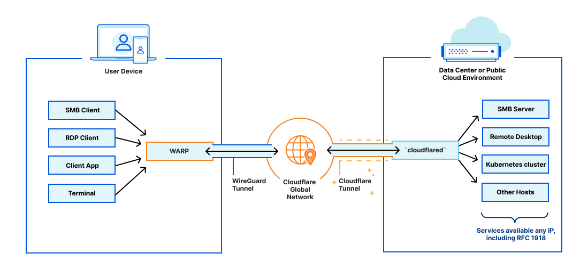
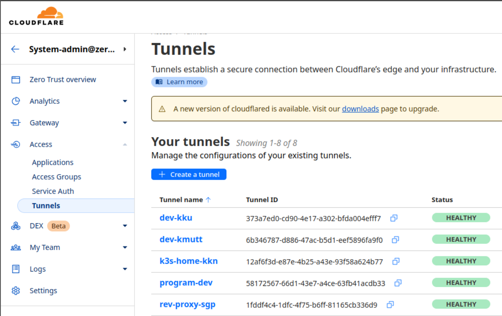
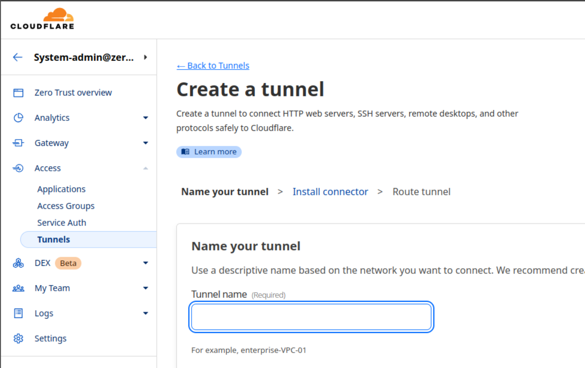
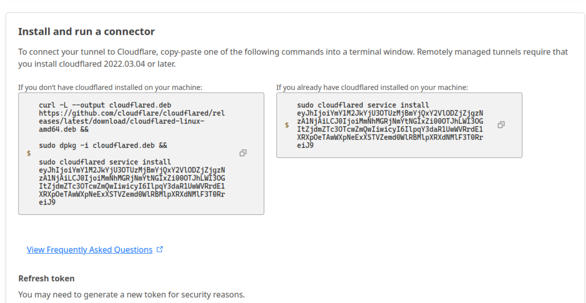
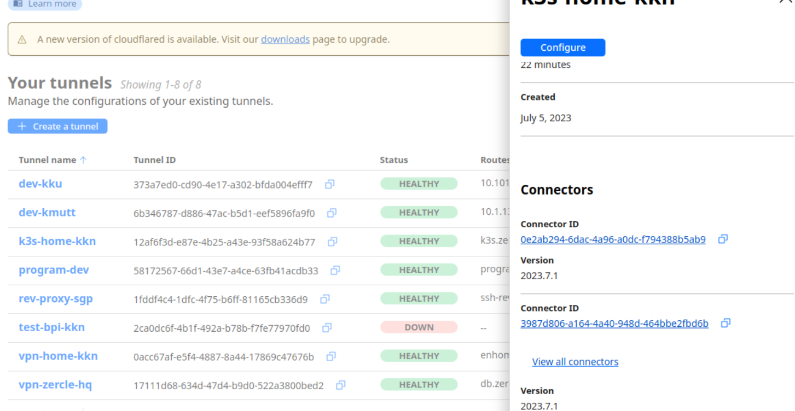
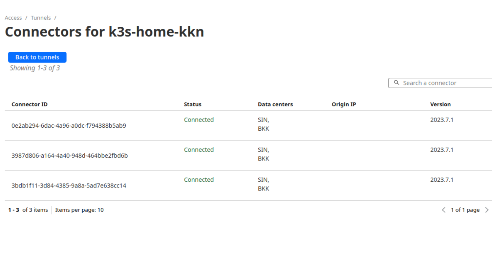
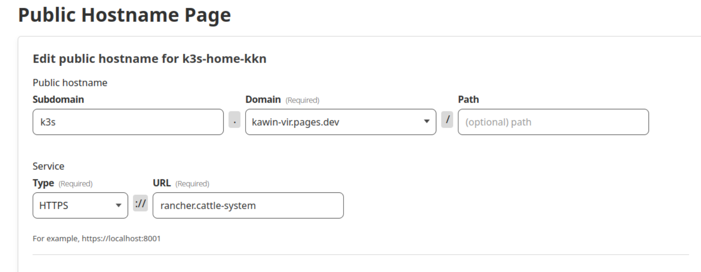
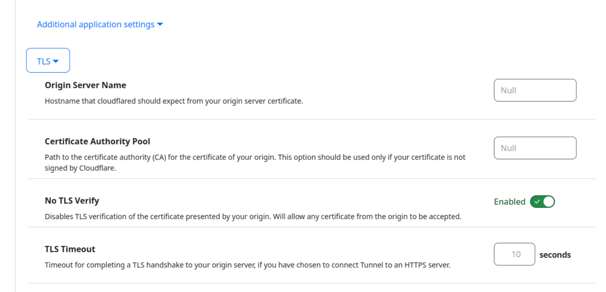
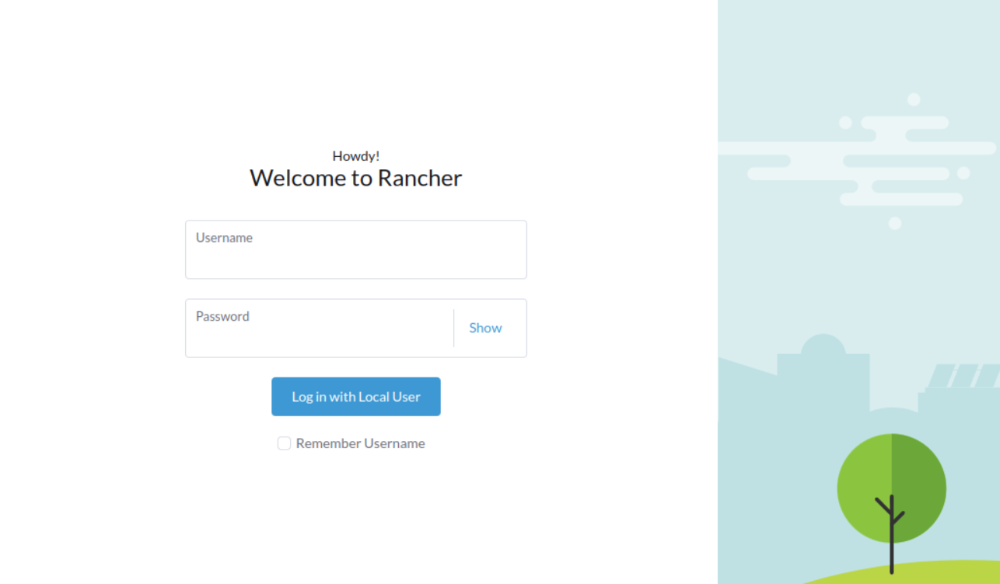
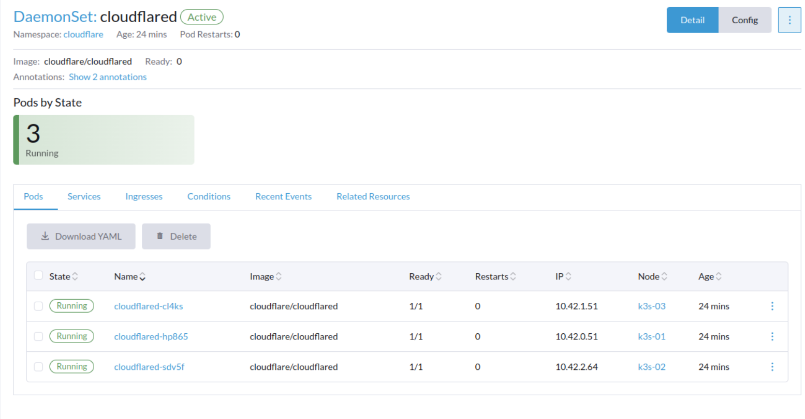

If you have a home lab or a service in K3S/K8S that you want to expose to the world, but you don't have a public IP, what can you do? Especially in today's world where ISPs often provide Carrier-grade NAT, or what's commonly known as large-scale NAT (LSN), making it difficult to update IPs with DDNS. This is where the hero of this article comes in.

<!--more-->

## What is Cloudflare Tunnel?

Cloudflare Tunnel, as the name suggests, creates a tunnel from your network to the Cloudflare network, making Cloudflare the front-end between you and the outside world.

## Creating a Cloudflare Tunnel
> You need to have at least one domain linked to Cloudflare.

Start by enabling it at https://one.dash.cloudflare.com/
Then go to Access > Tunnels > Create a tunnel


Name your Tunnel


Get the tunnel token to put into a kube secret when deploying.


## Deploying Cloudflare Tunnel on K3S/K8S

Create a `cloudflared-daemonset.yml` file like this, by converting the tunnel token to base64 and putting it in a secret named `cf_tunnel_token`.


Then deploy with:
```bash
kubectl apply -f cloudflared-daemonset.yml
```

## Exposing services to the outside world
Check the status in the Cloudflare One dashboard to confirm that your tunnel is connected.


It's like having a kube-proxy + load balancer all in one!


Then we can reverse proxy to our service in the cluster, for example, `service_name.namespace`, such as `https` to `rancher` on the `cattle-system` namespace, as shown in the image.

If the service uses a self-signed SSL, we need to tell Cloudflare to skip verification.



## Testing the service access



