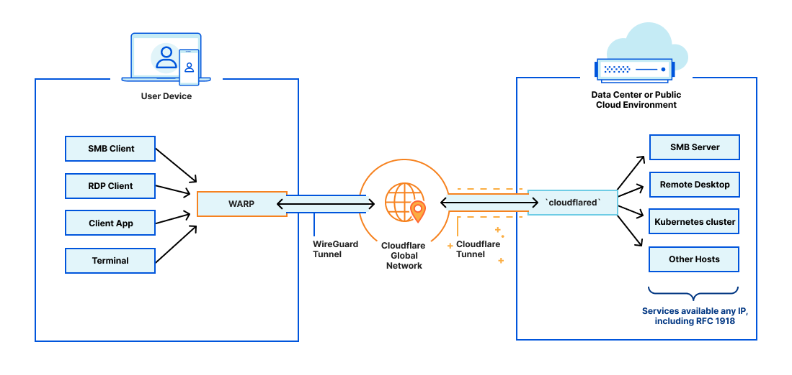
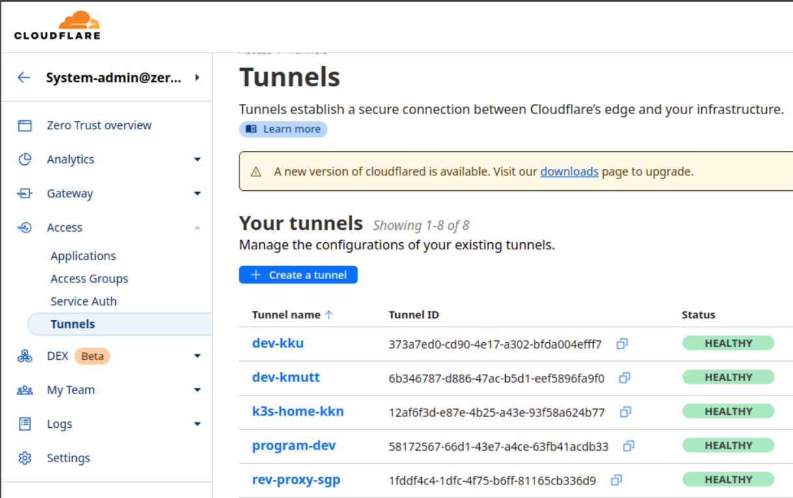
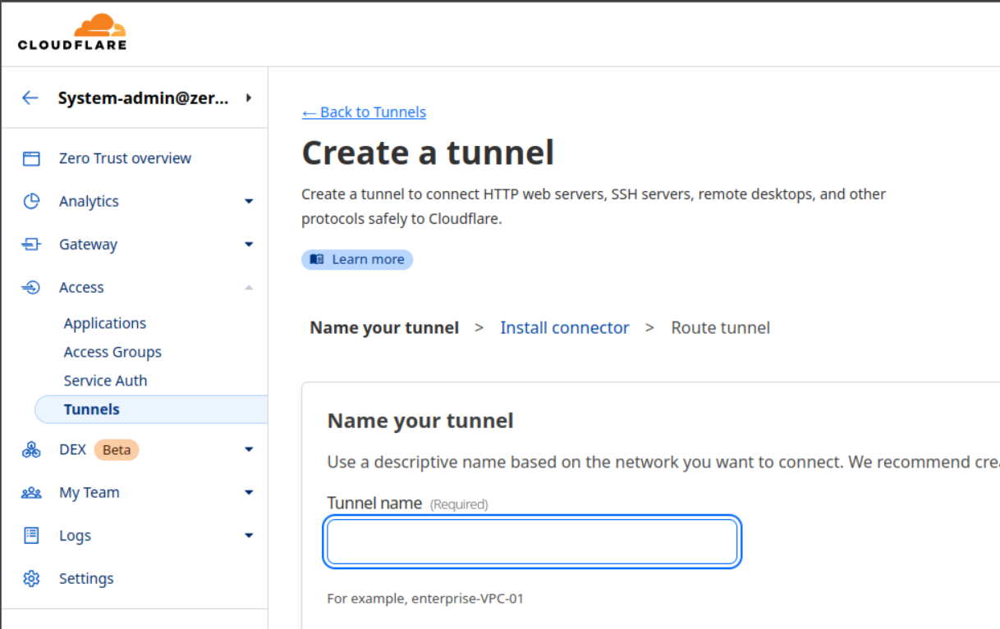
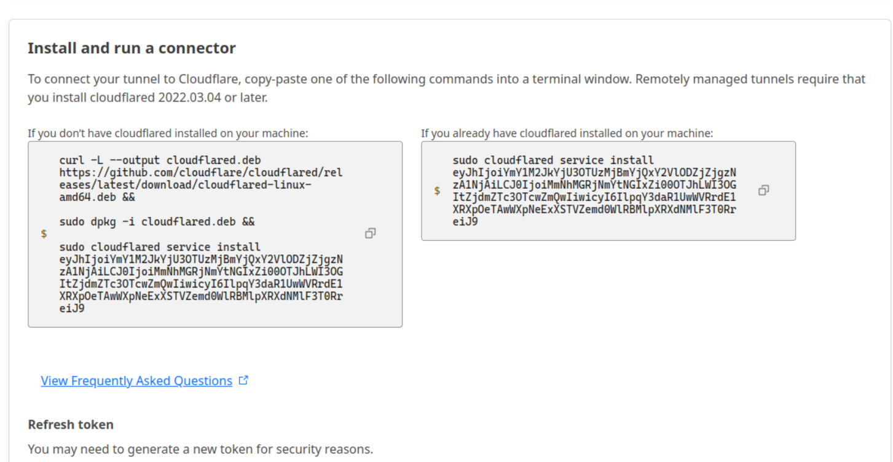
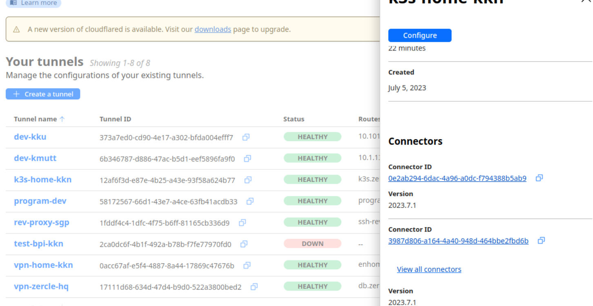
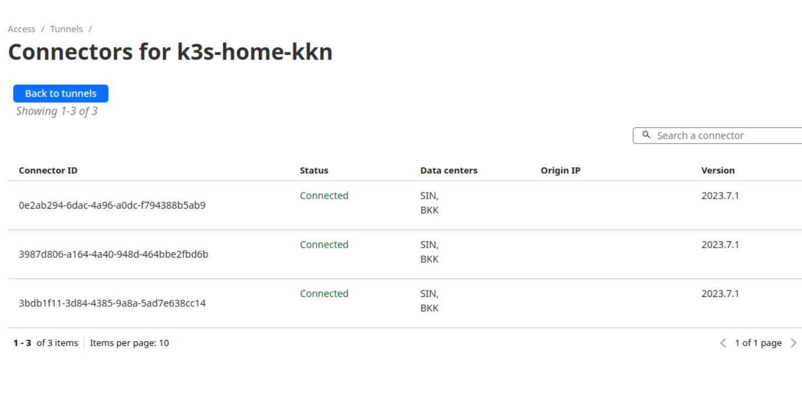
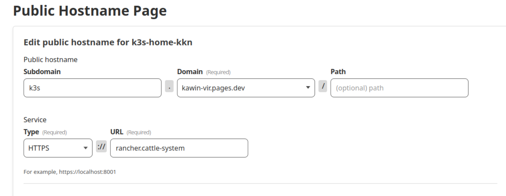
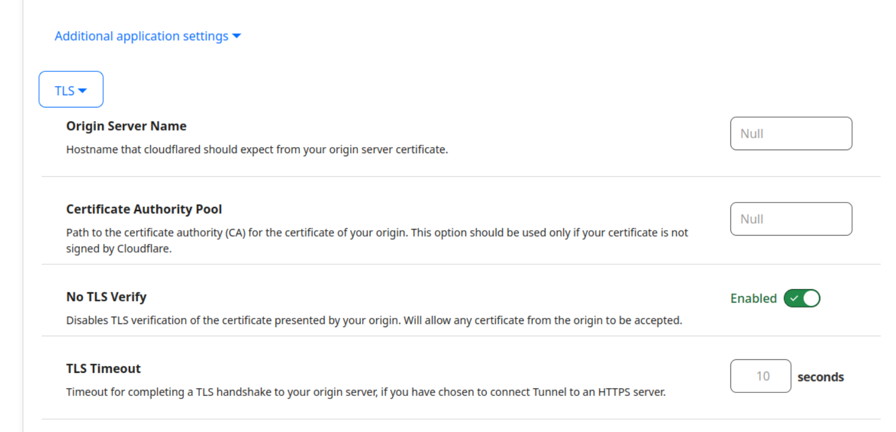
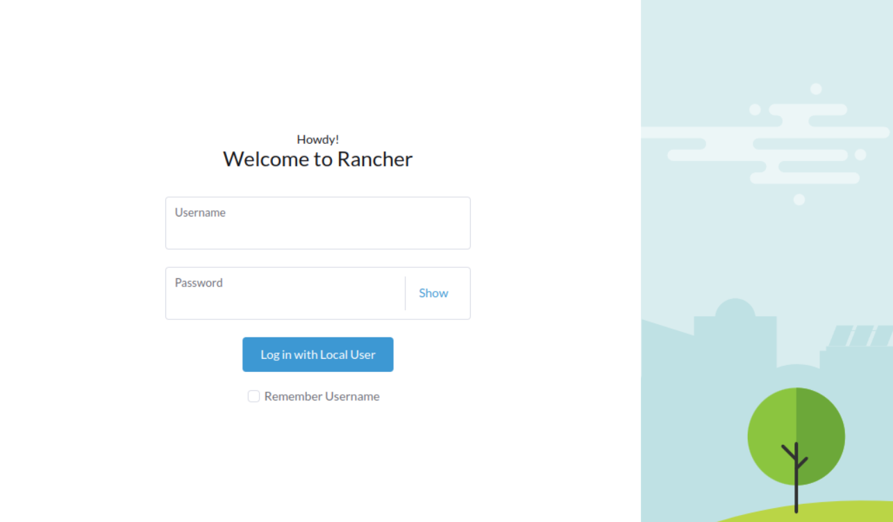
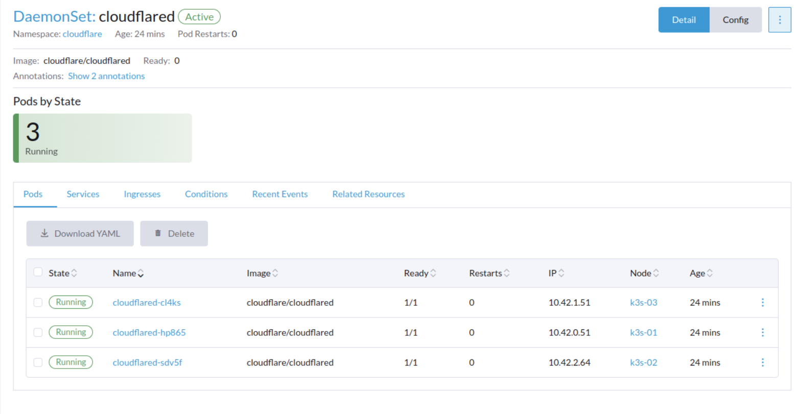

หากเรามี home lab หรือ service ที่อยู่ใน k3s/k8s อยากเปิดให้ชาวโลกได้เข้ามาใช้งาน แต่ไม่มี public IP จะทำอย่างไรได้นะ ยิ่งในโลกที่ทุกวันนี้ ISP แจก IP แบบ Carrier-grade NAT หรือเรียกติดปากกันว่า large-scale NAT (LSN) ทำให้จะใช้ DDNS ก็ลำบากอัปเดต IP กันอีก จึงเป็นที่มาของพระเอกในบทความนี้ครับ

<!--more-->

## cloudflare tunnel คืออะไร

Cloudflare tunnel ตามชื่อเลยคือการสร้าง tunnel จากเราเข้าไปที่ cloudflare network ทำให้ cloudflare กลายมาเป็นหน้าด่านให้ระหว่างเราและโลกภายนอก

## สร้าง cloudflare tunnel
> เราต้องมีโดเมนที่ผูกไว้กับ cloudflare ก่อนอย่างน้อยหนึ่งชื่อนะครับ

เริ่มต้นจากเปิดใช้งานที่ https://one.dash.cloudflare.com/
แล้วเข้าเมนู Access > Tunnels > Create a tunnel


ตั้งชื่อ Tunnel


เอาค่า tunnel token เพื่อไปใส่ใน kube secret ตอน deploy


## deploy cloudflare tunnel บน k3s/k8s

สร้างไฟล์ `cloudflared-daemonset.yml` หน้าตาประมาณนี้ โดยเอาค่า tunnel token ไปแปลงเป็น base64 แล้วใส่ไว้ใน secret ชื่อ `cf_tunnel_token`


จากนั้น deploy ด้วย
```bash
kubectl apply -f cloudflared-daemonset.yml
```

## expose service สู่โลกภายนอก
เช็คสถานะใน cloudflare one dashboard ว่า tunnel เราเชื่อมต่อได้แล้ว


เสมือนว่าได้ kube-proxy + load balancer กันเลยทีเดียว


แล้วเราก็สามารถทำ reverse proxy เข้าไปหา servic ใน cluster เราได้เลยในเช่น `service_name.namespace` เช่น `https` ไปที่ `rancher` บน namspace `cattle-system` จะได้ตามภาพ

กรณีที่ service ใช้งาน self sign SSL เราต้องตั้งให้ cloudflare skip verify ไปด้วยครับ



## ทดสอบเข้า service



