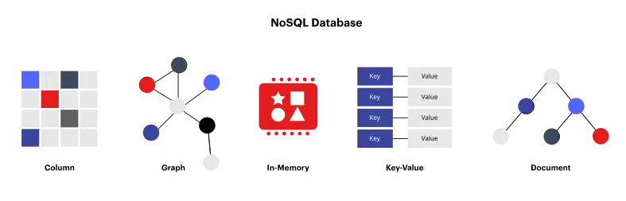

<!--more-->

## What is NoSQL?
The term **NoSQL** usually makes most people think of **NoSQL databases** or **non-relational databases**, but it actually means **non SQL** or **not only SQL**. In layman's terms, it's a database that stores data outside of relational tables. Its main advantage is that the schema is more flexible than being locked down by a table structure.
> You might argue that **SQL DB** can `ALTER TABLE`, but if you have a massive amount of data or have scaled to use a **distributed DB**, `ALTER`ing it once will not be fun.

## Advantages of NoSQL
### Scalability
Instead of scaling up by increasing the resources of a server like relational DBs (Vertical scaling), NoSQL DBs often scale up by using distributed data clusters (Horizontal scaling). Some cloud providers manage these operations behind the scenes, making it quick to scale up or down according to the incoming load.
### Flexibility
NoSQL DBs often have flexible schemas that allow for faster development and easier adaptation to changes. Their flexible data models make them suitable for semi-structured and unstructured data.
### High-performance
Compared to relational DBs, NoSQL DBs are designed to be optimized for specific data types, resulting in higher performance (if used for the right type of task).

## Types of NoSQL DB

Let's go through the main types of NoSQL DBs that I know and have used.

### Key-value DB
Key-value DBs store data as pairs, where each pair has a unique ID, and the data value can be stored flexibly because the value doesn't have a strict structure.
- Suitable for:
  - Session management systems
  - Storing user settings
- Examples:
  - [BadgerDB](https://github.com/dgraph-io/badger)
  - [TiKV](https://github.com/tikv/tikv)

### In-memory key-value DB
The structure is similar to Key-value DB, but the data is stored in memory (mainly RAM). This makes reading and writing very fast, but it comes at the cost of RAM usage, and data can be lost if the system crashes. We can reduce this risk by taking snapshots and storing them periodically.
- Examples:
  - [Dragonfly](https://github.com/dragonflydb/dragonfly)
  - [Redis](https://github.com/redis/redis)
  - [Memcached](https://github.com/memcached/memcached)

### Document DB
The structure is similar to Key-value DB, except that the Key-value of Document DB is stored in document formats like JSON, XML, or YAML, grouped into collections.
- Suitable for:
  - User profiles
  - Product catalogs
  - CMS page content
- Examples:
  - [MongoDB](https://github.com/mongodb/mongo)

### Wide-column DB
Wide-column DBs have tables similar to relational tables, but they are better because they don't have as strict column schemas as relational ones. This means that each row doesn't necessarily need to have values in every column, and you can combine different parts of rows and columns with different data formats (I tried this and loved it; it's like a hybrid of relational and non-relational).
- Suitable for:
  - Telemetry data
  - Analytics data
  - Time-series data
  - Online Messaging / Chat systems
- Examples:
  - [ScyllaDB](https://github.com/scylladb/scylladb)

### Graph DB
This is a database that stores graph data to map relationships between data.
- Suitable for:
  - Social relationship data
  - Data used for recommendation engines (e.g., advertising)
- Examples:
  - [Dgraph](https://github.com/dgraph-io/dgraph)
  - [Neo4j](https://github.com/neo4j/neo4j)

### Time series DB
As the name suggests, this is a database that doesn't store data by ID but by time.
- Suitable for:
  - Data from industrial systems
  - DevOps data
  - Data collected from the Internet of Things (IoT)
- Examples:
  - [QuestDB](https://github.com/questdb/questdb)
  - [InfluxDB](https://github.com/influxdata/influxdb)

### Immutable DB
Immutable DBs store data changes used to verify data integrity, similar to Blockchain, Version Control (I admit I tried playing with this and it's still confusing, seems a bit too specialized).
- Suitable for:
  - Accounting systems
  - Event logging systems that require change tracking
- Examples:
  - [immudb](https://github.com/codenotary/immudb)
  - [Dolt](https://github.com/dolthub/dolt)

### Vector DB
A vector database stores data as high-dimensional numerical vectors (embeddings) and retrieves items by similarity rather than exact match. This makes them the backbone of modern AI workloads where you search by meaning, not by keyword.
- Suitable for:
  - Retrieval-Augmented Generation (RAG) for LLMs
  - Semantic and similarity search over text, images, or audio
  - Recommendation engines
  - AI agents that need long-term memory
- Examples:
  - [Milvus](https://github.com/milvus-io/milvus) — cloud-native, built for very large scale
  - [Qdrant](https://github.com/qdrant/qdrant) — Rust-based, low latency, strong filtering
  - [Weaviate](https://github.com/weaviate/weaviate) — GraphQL API with modular vectorizer integrations
  - [pgvector](https://github.com/pgvector/pgvector) — PostgreSQL extension, ideal when you already run Postgres
  - [Chroma](https://github.com/chroma-core/chroma) — lightweight, popular for prototyping
