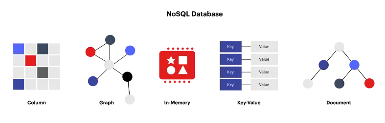

<!--more-->

## NoSQL คือ?
คำว่า **NoSQL** คนส่วนใหญ่จะนึกถึง **NoSQL database** หรือ **non-relational database** แต่จริง ๆ แล้วมันคือ **non SQL** หรือ **not only SQL** ภาษาคนคือ ฐานข้อมูลที่เก็บข้อมูลโดยนอกเหนือจากการเก็บในตารางความสัมพันธ์ (relational table) โดยจุดเด่นเลยคือ schema จะยืดหยุนกว่าการโดนล็อคไว้ด้วยโครงสร้างตาราง
> ถึงจะเถียงว่า **SQL DB** ก็ `ALTER TABLE` เอาสิ แต่ถ้ามีข้อมูลมหาศาล หรือได้สเกลไปใช้งาน **distributed DB** แล้วละก็ `ALTER` ทีนึง ไม่สนุกแน่ ๆ

## จุดเด่นของ NoSQL
### Scalability
แทนที่จะ scale up โดยการเพิ่มขนาด resources ของเซิร์ฟเวอร์แบบ relational DB (Vertical scaling) NoSQL DB มักจะ scale up โดยใช้คลัสเตอร์ข้อมูลแบบกระจายศูนย์ (Horizontal scaling) ซึ่งผู้ให้บริการคลาวด์บางรายจะจัดการการดำเนินงานเหล่านี้เบื้องหลังให้เสร็จสรรพ ทำให้การทำให้การเพิ่มลดขนาดตามโหลดที่เข้ามาทำได้รวดเร็ว
### Flexibility
NoSQL DB มักจะมีโครงร่างที่ยืดหยุ่นซึ่งช่วยให้การพัฒนาเร็วขึ้นและเป็นตอบสนองต่อการเปลี่ยนแปลงได้ง่ายขึ้น แถมการที่มีรูปแบบข้อมูลแบบยืดหยุ่น ทำให้เหมาะสำหรับข้อมูลกึ่งโครงสร้างความสัมพันธ์และข้อมูลที่ไม่มีโครงสร้างตายตัว
### High-performance
เมื่อเปรียบเทียบกับ relational DB แล้ว NoSQL DB จะได้รับการออกแบบให้เหมาะสมสำหรับข้อมูลที่มีรูปแบบเฉพาะทางตามประเภทของข้อมูล ซึ่งส่งผลให้ประสิทธิภาพสูงขึ้น (ถ้าใช้ถูกกับประเภทของงานละนะ)

## ประเภทของ NoSQL DB

มาไล่เรียงประเภทหลัก ๆ ของ NoSQL DB เท่าที่ผมรู้จักและเคยใช้งานมาบ้าง

### Key-value DB
Key-value DB จะจัดเก็บข้อมูลเป็นคู่ โดยแต่ละคู่จะมี ID ที่ไม่ซ้ำกัน และค่าข้อมูลสามารถเก็บได้แบบยืดหยุน เนื่องจาก value ไม่ได้มีโครงสร้างมาบังคับ
- เหมาะสำหรับ
  - ระบบจัดการ Session
  - จัดเก็บการตั้งค่าของ users
- ตัวอย่าง
  - [BadgerDB](https://github.com/dgraph-io/badger)
  - [TiKV](https://github.com/tikv/tikv)

### In-memory key-value DB
รูปแบบจะเหมือนกับ Key-value DB แต่ข้อมูลจะถูกเก็บไว้เป็นในหน่วยความจำ (หลัก ๆ ก็ RAM นะแหละ) ทำให้การอ่านการเขียนเร็วมาก แต่ก็แลกมาด้วยปริมาณการใช้งาน RAM และข้อมูลอาจจะหายถ้าระบบล่ม ซึ่งเราก็ลดความเสี่ยงลงได้ จากการตั้ง snapshot เก็บลง storage เป็นระยะ
- ตัวอย่าง
  - [Dragonfly](https://github.com/dragonflydb/dragonfly)
  - [Redis](https://github.com/redis/redis)
  - [Memcached](https://github.com/memcached/memcached)

### Document DB
โครงสร้างจะคล้ายกับ Key-value DB เลย ยกเว้นว่า Key-value ของ Document DB จะถูกเก็บไว้ในรูปแบบ document เช่น JSON, XML หรือ YAML รวมกันเป็น collections
- เหมาะสำหรับ
  - โปรไฟล์ผู้ใช้งาน
  - แคตตาล็อกผลิตภัณฑ์
  - เนื้อหาเพจ CMS
- ตัวอย่าง
  - [MongoDB](https://github.com/mongodb/mongo)

### Wide-column DB
Wide-column DB จะมี table คล้าย ๆ กับ relational table แต่ดีตรงที่ไม่มีรูปแบบ column ที่เข้มงวดเท่ากับ relational ก็คือ ในแต่ละ row ไม่จำเป็นต้องมีค่าในทุก column และสามารถรวมส่วนต่าง ๆ ของ row และ column ที่มีรูปแบบข้อมูลที่แตกต่างกันไว้ด้วยได้ (อันนี้ลองเล่นแล้ว ชอบมากเหมือนลูกครึ่ง relational กับ non-relational เลย)
- เหมาะสำหรับ
  - ข้อมูล Telemetry
  - ข้อมูล Analytics
  - ข้อมูลตามช่วงเวลา
  - ระบบ Online Messaging / Chat
- ตัวอย่าง
  - [ScyllaDB](https://github.com/scylladb/scylladb)

### Graph DB
เป็น DB ที่เก็บข้อข้อมูลกราฟสร้างแผนที่ความสัมพันธ์ระหว่างข้อมูล
- เหมาะสำหรับ
  - ข้อมูลความสัมพันธ์ทางสังคม
  - ข้อมูลที่ใช้ทำเครื่องมือแนะนำ (Ads นะแหละ ถถถ)
- ตัวอย่าง
  - [Dgraph](https://github.com/dgraph-io/dgraph)
  - [Neo4j](https://github.com/neo4j/neo4j)

### Time series DB
ก็ตามชื่อเลยเป็น DB ที่ไม่ได้เก็บข้อมูลเรียงตาม ID แต่เก็บข้อมูลตามกระแสเวลา
- เหมาะสำหรับ
  - ข้อมูลจากระบบอุตสาหกรรม
  - ข้อมูลงานทาง DevOps
  - ข้อมูลที่เก็บมาจาก Internet of Things (IoT)
- ตัวอย่าง
  - [QuestDB](https://github.com/questdb/questdb)
  - [InfluxDB](https://github.com/influxdata/influxdb)

### Immutable DB
Immutable DB เป็น DB ที่จัดเก็บการเปลี่ยนแปลงข้อมูลที่ใช้เพื่อตรวจสอบความสมบูรณ์ของข้อมูล คล้าย ๆ Block Chain, Version Control (อันนี้ยอมรับก่อนเลยว่าลองเล่นดูแล้วยัง งง ๆ เหมือนจะเฉพาะทางไปหน่อย)
- เหมาะสำหรับ
  - ระบบบัญชี
  - ระบบบันทึกเหตุการณ์ที่ต้องการติดตามความเปลี่ยนแปลง
- ตัวอย่าง
  - [immudb](https://github.com/codenotary/immudb)
  - [Dolt](https://github.com/dolthub/dolt)

### Vector DB
ขอแปะไว้ก่อนนะ ไว้ลองเล่นแล้วจะมาเพิ่มให้
- (น่าจะ) เหมาะสำหรับ
  - ระบบรู้จำภาพ
  - Natural Language Processing (NLP)
  - เครื่องมือแนะนำ (Ads นะแหละ ถถถ)
- ตัวอย่าง
  - [Milvus](https://github.com/milvus-io/milvus)
  - [Chroma](https://github.com/chroma-core/chroma)
  - [Weaviate](https://github.com/weaviate/weaviate) 