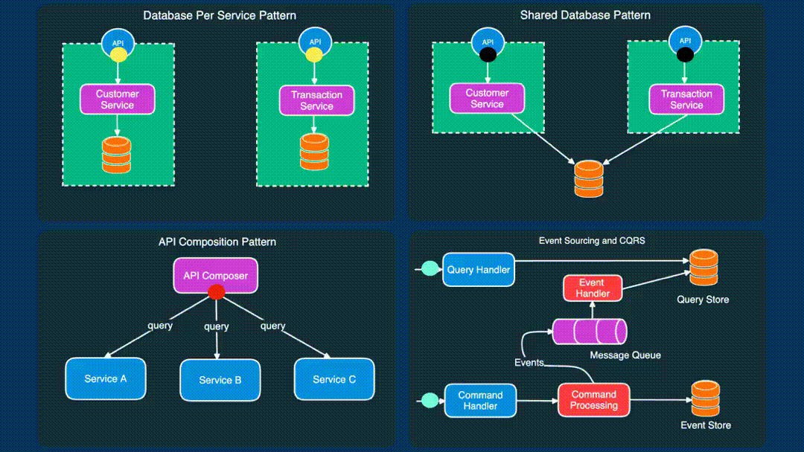

Building microservices is NOT easy.

Even in the best of times, you might end up in a mess.

But if you still have to build microservices for some reason, it’s better to know a few patterns that can make your life easy.

Here are 4 must-know patterns for building microservices:

<!--more-->

✅ Database per service

- In this pattern, each microservice manages its own data.
- This means that no other service can access that data directly.
- Communication or exchange of data can only happen through the owner service.
- The success of this pattern depends on how well you’ve defined the bounded context of your application.

✅ Shared Database

- Avoid this pattern as much as possible
- But sometimes, it’s the only viable option to incrementally move to a microservice architecture.
- This approach is lenient in the sense that multiple services use a shared database.
- However, it creates a bigger impact surface and chances of run-time issues.

✅ API Composition

- This pattern tries to solve the problem of implementing complex queries in a microservices architecture.
- An API Composer invokes other services in the required order.
- After fetching the results, it performs an in-memory join of the data before returning it to the caller.
- This is an inefficient approach due to in-memory joins on potentially large datasets.

✅ CQRS + Event Sourcing

- Next, we have CQRS
- It can help get around the issues with the API Composition Pattern.
- An application listens to domain events from other services and updates a separate query database. This makes it easy to serve complex aggregation queries.
- CQRS can also be combined with Event Sourcing where you store the state of the entity (aggregate) as a sequence of events.
- Of course, this pattern can sometimes be unfamiliar to the developers.

At the end of the day, no pattern is perfect.