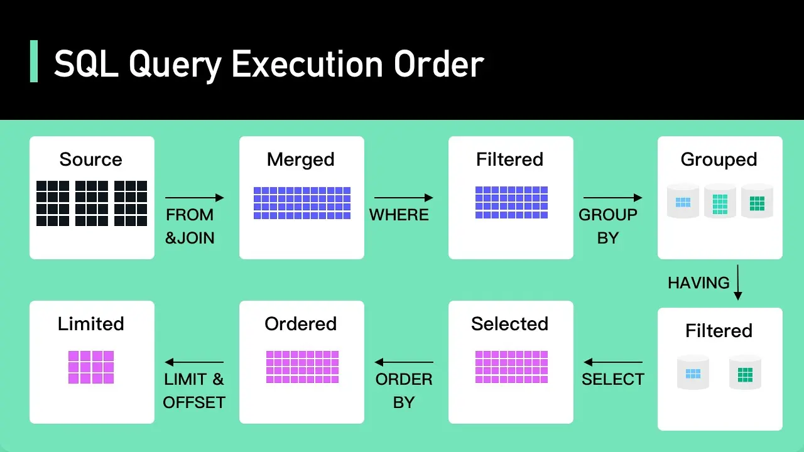

<!--more-->

## Offset / Limit
Let's start with the classic approach that everyone has probably used: Offset / Limit.
```sql
SELECT
  *
FROM
  users
ORDER BY
  created_at
LIMIT
  20 OFFSET 800;
```

This seems convenient as you can jump to any page, but it comes at a cost: Offset is expensive. This is because Offset reads all the data first and then discards what's not needed. This means that Offset is not an offset of the Datasource, but an offset of the Query Result. The more data there is, the more data needs to be accessed and then discarded.

If you don't understand Query Execution Order, [you can learn more from ByteByteGo here](https://www.youtube.com/watch?v=BHwzDmr6d7s).

## Cursor
Next is using an Index Cursor.
```sql
SELECT
  *
FROM
  users
WHERE
  _id > ${last_seen}
ORDER BY
  created_at
LIMIT
  20;
```
The advantage of this method is that it jumps to access data at the point indicated by the Index, so no matter how much data there is, it won't read everything and then discard it. However, the disadvantage is that this method cannot use page-based pagination like the Offset method, but it can use the Index as `last_seen`, which makes fetching data very fast. This is suitable for infinite scrolling pages.

## Offset / Limit + Deferred Joins
Since Offset / Limit is convenient but wasteful, we can reduce the waste by reducing the amount of data discarded by using Deferred Joins.
```sql
SELECT
  *
FROM
  users
  INNER JOIN (
    SELECT
      _id
    FROM
      users
    ORDER BY
      created_at
    LIMIT
      20 OFFSET 800
    ORDER BY
      created_at;
  ) AS sub_users USING (_id)
```
This means we select the index based on the filter to create a subset, and then join it with the actual data only for what we need.
