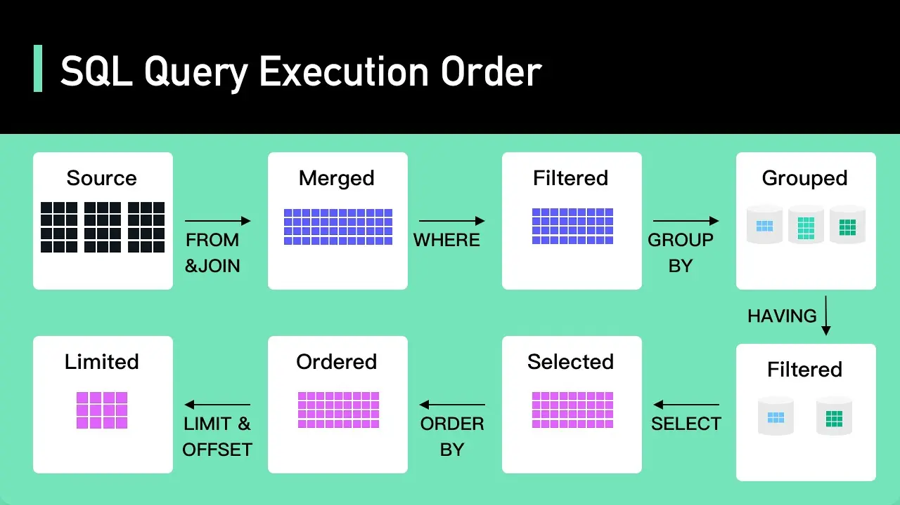

<!--more-->

## Offset / Limit
เริ่มจากท่า classic ที่ทุกคนน่าจะเคยใช้กันอยู่แล้วคือ Offset / Limit นั่นเอง
```sql
SELECT
  *
FROM
  users
ORDER BY
  created_at
LIMIT
  20 OFFSET 800;
```

ซึ่งก็ดูสะดวกดีที่สามารถเลือกกระโดดไปหน้าไหนก็ได้ แต่มันมีสิ่งที่ต้องแลกมานั่นคือ Offset มันแพงนั่นเอง เพราะ Offset คือการอ่านข้อมูลออกมาก่อนแล้วค่อยปัดทิ้ง หมายความว่า Offset ไม่ใช่ Offset ของ Datasource แต่มันคือ Offset ของ Query Result ซึ่งถ้ายิ่งข้อมูลมากขึ้นก็หมายถึงจำนวนข้อมูลที่ต้อง Access ออกมาแล้วก็ Discard มากขึ้นนั่นเอง

ถ้ายังไม่เข้าใจ Query Execution Order [สามารถศึกษาเพิ่มเติมจาก ByteByteGo ได้ที่นี้](https://www.youtube.com/watch?v=BHwzDmr6d7s)

## Cursor
ต่อมาคือการใช้ Index Cursor
```sql
SELECT
  *
FROM
  users
WHERE
  _id > ${last_seen}
ORDER BY
  created_at
LIMIT
  20;
```
ข้อดีของวิธีนี้คือเป็นการกระโดดไป Access ข้อมูล ณ จุดที่ Index ชี้อยู่ทำให้ไม่ว่าข้อมูลจะเยอะ ก็จะไม่เกิดการไล่อ่านทั้งหมดแล้วปัดทิ้ง แต่ข้อเสียเลยคือ วิธีนี้จะไม่สามารถใช้ Pagination แบบกำหนดหน้าได้เหมือนวิธี Offset แต่ใช้ Index เป็น last_seen ได้เลยทำให้การ fetch ข้อมูลได้รวดเร็ว ซึ่งจะเหมาะกับงาน Infinite page ที่เลื่อนต่อ ๆ กันได้เลย

## Offset / Limit + Deferred Joins
เนื่องจาก Offset / Limit ใช้งานสะดวกแต่ก็แลกมาด้วยความเปลือง แต่เราสามารถลดความเปลืองลงได้ด้วยการลดขนาดการโยนข้อมูลทิ้งได้ด้วยการใช้ Deferred Joins นั่นเอง
```sql
SELECT
  *
FROM
  users
  INNER JOIN (
    SELECT
      _id
    FROM
      users
    ORDER BY
      created_at
    LIMIT
      20 OFFSET 800
    ORDER BY
      created_at;
  ) AS sub_users USING (_id)
```
นั่นคือเรา select index ตาม filter ออกมาเพื่อทำเป็น subset แล้วไป join เอาตัวข้อมูลจริง ๆ ออกมาเฉพาะที่เราใช้งานนั่นเอง