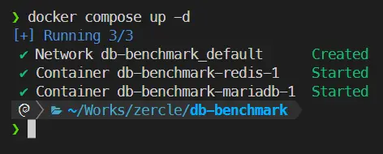
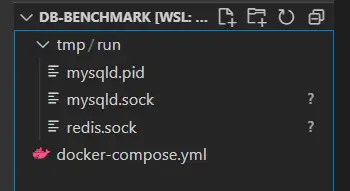
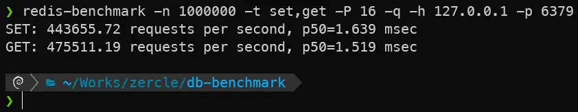
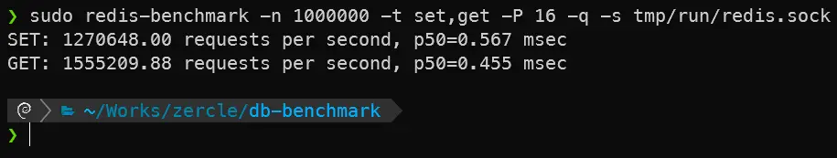
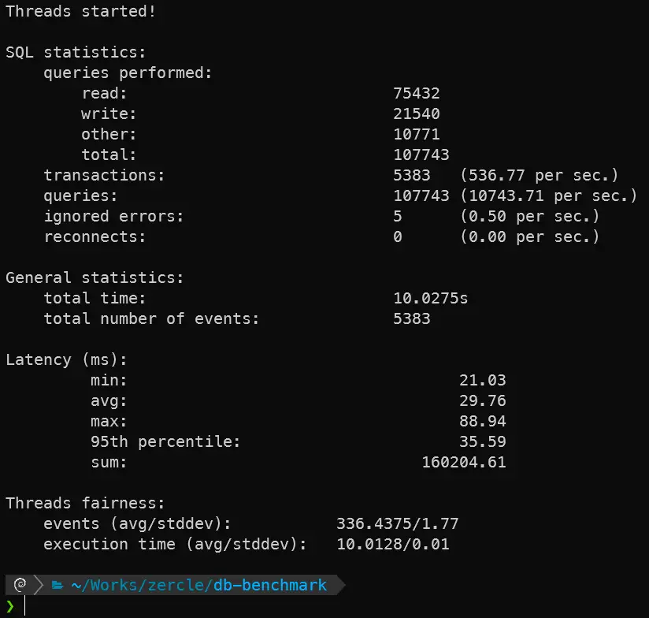
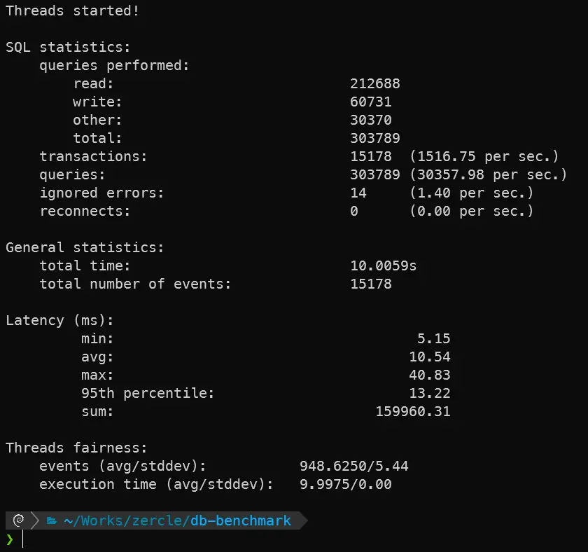

ปกติแล้วเวลาใช้งาน database ในระดับงานที่ไม่ใหญ่มาก ใน container เราก็มักจะเชื่อมต่อกันด้วย TCP/IP กันถูกไหมครับ แต่รู้หรือไม่ว่าเราสามารถเพิ่มประสิทธิภาพง่าย ๆ ด้วยการลด overhead ของ TCP ออกด้วยการใช้ Unix socket แทนผลจะเป็นยังไงลองมาดูกันครับ

<!--more-->

## `docker-compose.yml`
เรามาเริ่มจากเปิด database ใน docker ด้วย docker compose ซึ่งพยายามให้ default ที่สุด ตามด้านล่างนี้
```yaml
x-default: &deafult-env
  TZ: Asia/Bangkok
x-mariadb: &mariadb-env
  MARIADB_ALLOW_EMPTY_ROOT_PASSWORD: true
  MARIADB_AUTO_UPGRADE: true

services:
  mariadb:
    image: mariadb:lts
    environment:
      <<: [*deafult-env, *mariadb-env]
    volumes:
      - mariadb_data:/var/lib/mysql
      - ./tmp/run:/run/mysqld
    ports:
      - 3306:3306

  redis:
    image: redis:alpine
    environment:
      <<: [*deafult-env]
    volumes:
      - redis_data:/data
      - ./tmp/run:/data/run
    command: [
        "redis-server",
        "--unixsocket /data/run/redis.sock",
      ]
    ports:
      - 6379:6379

volumes:
  mariadb_data:
  redis_data:
```

หลังจาก `docker compose up -d` ก็จะได้ประมาณนี้

หน้าตาของ Unix socket


## redis
เริ่มจาก database ที่เร็วและง่ายที่สุดในตัวอย่างกันก่อน โดยจะทดสอบ read, write

### tcp

```bash
redis-benchmark -n 1000000 -t set,get -P 16 -q -h 127.0.0.1 -p 6379
```

ผลที่ได้


### unix socket

```bash
redis-benchmark -n 1000000 -t set,get -P 16 -q -s tmp/run/redis.sock
```

ผลที่ได้


## mariadb
มาต่อด้วย database ยอดนิยมตัวนึง โดยจะทดสอบ read, write เหมือนเดิม

### prepare ข้อมูลทำหรับทดสอบ
เริ่มจากการสร้าง database และ table สำหรับ sysbench
```bash
sysbench oltp_read_write --db-driver=mysql --mysql-host=127.0.0.1 --mysql-user=root --mysql-db=sysbenchtest --threads=16 prepare
```

### tcp

```bash
sysbench oltp_read_write --db-driver=mysql --mysql-host=127.0.0.1 --mysql-user=root --mysql-db=sysbenchtest --threads=16 run
```

ผลที่ได้


### unix socket

```bash
sysbench oltp_read_write --db-driver=mysql --mysql-socket=tmp/run/mysqld.sock --mysql-user=root --mysql-db=sysbenchtest --threads=16 run
```

ผลที่ได้


## สรุป

|                    | **read (req/s)** | **write (req/s)** | **latency avg (ms)** |
|--------------------|------------------|-------------------|----------------------|
| redis TCP          | 475,511.19       | 443,655.72        | 1.519 / 1.639        |
| redis UnixSocket   | 1,555,209.88     | 1,270,648.00      | 0.455 / 0.567        |
| mariaDB TCP        | 75,432           | 21,540            | 29.76                |
| mariaDB UnixSocket | 212,688          | 60,731            | 10.54                |

จะเห็นได้ว่าหากเราลด overhead ของ TCP ออกด้วยการใช้ Unix socket แทน จะทำให้เราไม่ต้องไป up scale ทรัพยากรของเราให้ใหญ่โต ก็สามารถรับโหลดได้เพิ่มมาขึ้นอีกเยอะเลย หรือในงานบน K8S ที่มีการทำ sidecar ก็สามารถใช้ Unix socket สือสารระหว่างกันแทน TCP/IP ได้นะครับ
> ปล. ใช้ได้ใน node ที่ใช้งาน volume ร่วมกันนะจร๊ะ