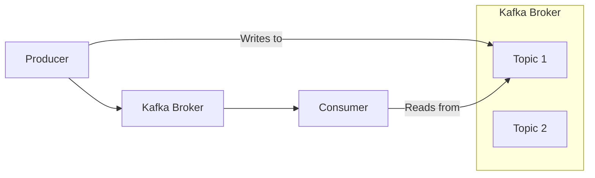
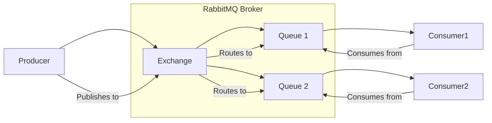
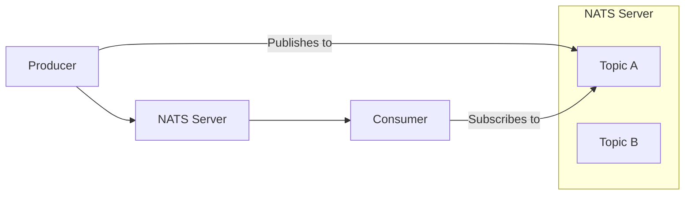

## Introduction

In the world of distributed systems, choosing the right messaging system is crucial. There are many options available, each with its own strengths and weaknesses. This post will compare Kafka, Valkey (Redis), RabbitMQ, and NATS to help you decide which one is best suited for your needs.

## Kafka

### Overview

Apache Kafka is a distributed streaming platform capable of handling trillions of events a day. It's designed for high-throughput, fault-tolerant, and scalable real-time data feeds.



### Use Cases

*   **Real-time analytics:** Processing large streams of data for immediate insights.
*   **Log aggregation:** Collecting logs from various services into a central system.
*   **Event sourcing:** Storing a sequence of events as the primary source of truth.

### Pros

*   High throughput and low latency.
*   Scalable and fault-tolerant.
*   Durable message storage.

### Cons

*   Complex to set up and manage.
*   Higher resource consumption compared to simpler systems.
*   Not ideal for traditional message queuing patterns (e.g., competing consumers with individual message acknowledgment).

## Valkey (Redis)

### Overview

Valkey, a fork of Redis, is an in-memory data structure store, often used as a database, cache, and message broker. It supports various data structures, including lists, which can be used for simple message queues.

```mermaid
graph LR
    Producer --> Redis[Valkey (Redis)]
    Redis --> Consumer
    subgraph Valkey (Redis)
        List[List (Queue)]
        PubSub[Pub/Sub Channel]
    end
    Producer -- LPUSH --> List
    Consumer -- BRPOP --> List
    Publisher -- PUBLISH --> PubSub
    Subscriber -- SUBSCRIBE --> PubSub
```

### Use Cases

*   **Simple message queues:** For scenarios where high throughput and advanced features are not required.
*   **Pub/Sub:** Real-time communication for chat applications or notifications.
*   **Caching:** As a high-performance cache.

### Pros

*   Extremely fast due to in-memory operations.
*   Simple to use and deploy.
*   Versatile, supporting multiple data structures.

### Cons

*   Messages are not durable by default (unless persistence is configured).
*   Limited message size.
*   Not designed for high-throughput streaming or complex message routing.

## RabbitMQ

### Overview

RabbitMQ is a widely used open-source message broker that implements the Advanced Message Queuing Protocol (AMQP). It's known for its robust messaging features, flexible routing, and reliability.



### Use Cases

*   **Asynchronous processing:** Decoupling services and offloading long-running tasks.
*   **Work queues:** Distributing tasks among multiple workers.
*   **Complex routing:** Delivering messages to specific consumers based on various criteria.

### Pros

*   Mature and feature-rich.
*   Flexible message routing.
*   Supports various messaging patterns (e.g., fanout, direct, topic).

### Cons

*   Can be slower than Kafka for high-throughput streaming.
*   Requires careful configuration for high availability.
*   Messages are typically consumed and removed, not designed for long-term storage.

## NATS

### Overview

NATS is a high-performance, lightweight messaging system designed for cloud-native applications, IoT, and microservices. It focuses on simplicity, performance, and availability.



### Use Cases

*   **Microservices communication:** Fast and reliable inter-service communication.
*   **IoT messaging:** Handling large numbers of small messages from devices.
*   **Command and control:** Sending commands to distributed systems.

### Pros

*   Extremely fast and lightweight.

*   Simple to deploy and manage.
*   Supports Pub/Sub and Request/Reply patterns.

### Cons

*   No built-in message persistence (NATS Streaming/JetStream provides this).
*   Less feature-rich compared to RabbitMQ for complex routing.
*   Not designed for long-term message storage like Kafka.

## Conclusion

The choice of messaging system depends heavily on your specific requirements:

*   **Kafka:** Ideal for high-throughput, durable, and scalable streaming data platforms.
*   **Valkey (Redis):** Best for simple, fast, in-memory queues, Pub/Sub, and caching.
*   **RabbitMQ:** Excellent for robust, flexible, and reliable message queuing with complex routing.
*   **NATS:** Perfect for high-performance, lightweight messaging in cloud-native and microservices architectures.

Consider your throughput needs, durability requirements, complexity of routing, and operational overhead when making your decision.
