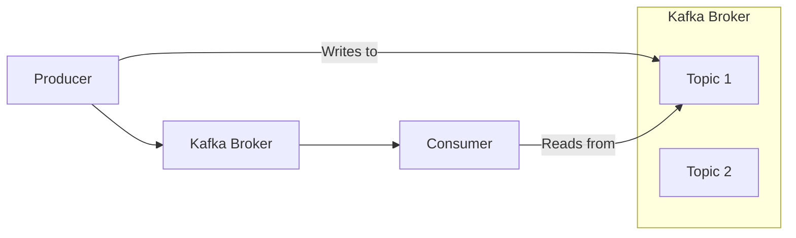
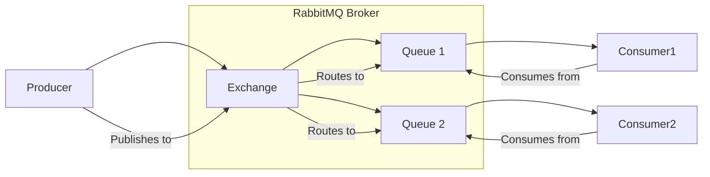
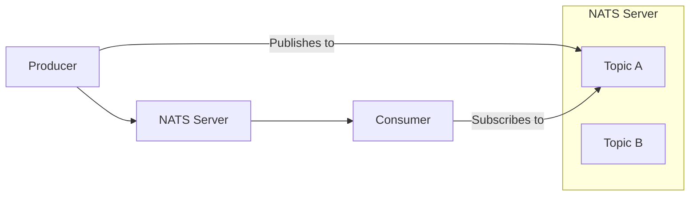

## บทนำ

ในโลกของระบบแบบกระจาย (distributed systems) การเลือกระบบ Messaging ที่เหมาะสมเป็นสิ่งสำคัญอย่างยิ่ง มีตัวเลือกมากมาย แต่ละตัวก็มีจุดแข็งและจุดอ่อนที่แตกต่างกัน โพสต์นี้จะเปรียบเทียบ Kafka, Valkey (Redis), RabbitMQ และ NATS เพื่อช่วยให้คุณตัดสินใจได้ว่าตัวเลือกใดเหมาะสมกับความต้องการของคุณมากที่สุด

## Kafka

### ภาพรวม

Apache Kafka เป็นแพลตฟอร์มสตรีมมิ่งแบบกระจายที่สามารถจัดการเหตุการณ์ได้หลายล้านล้านเหตุการณ์ต่อวัน ได้รับการออกแบบมาสำหรับฟีดข้อมูลแบบเรียลไทม์ที่มีปริมาณงานสูง ทนทานต่อข้อผิดพลาด และปรับขนาดได้



### กรณีการใช้งาน

*   **การวิเคราะห์แบบเรียลไทม์:** ประมวลผลสตรีมข้อมูลขนาดใหญ่เพื่อข้อมูลเชิงลึกทันที
*   **การรวมบันทึก (Log aggregation):** รวบรวมบันทึกจากบริการต่างๆ เข้าสู่ระบบส่วนกลาง
*   **Event sourcing:** จัดเก็บลำดับของเหตุการณ์เป็นแหล่งความจริงหลัก

### ข้อดี

*   ปริมาณงานสูงและเวลาแฝงต่ำ
*   ปรับขนาดได้และทนทานต่อข้อผิดพลาด
*   จัดเก็บข้อความได้อย่างคงทน

### ข้อเสีย

*   ซับซ้อนในการตั้งค่าและจัดการ
*   ใช้ทรัพยากรสูงกว่าเมื่อเทียบกับระบบที่เรียบง่ายกว่า
*   ไม่เหมาะสำหรับรูปแบบการจัดคิวข้อความแบบดั้งเดิม (เช่น ผู้บริโภคที่แข่งขันกันพร้อมการรับทราบข้อความแต่ละรายการ)

## Valkey (Redis)

### ภาพรวม

Valkey ซึ่งเป็น fork ของ Redis เป็นที่เก็บโครงสร้างข้อมูลในหน่วยความจำ มักใช้เป็นฐานข้อมูล แคช และ Message Broker รองรับโครงสร้างข้อมูลที่หลากหลาย รวมถึงรายการ (lists) ซึ่งสามารถใช้สำหรับคิวข้อความแบบง่ายได้

```mermaid
graph LR
    Producer --> Redis[Valkey (Redis)]
    Redis --> Consumer
    subgraph Valkey (Redis)
        List[List (Queue)]
        PubSub[Pub/Sub Channel]
    end
    Producer -- LPUSH --> List
    Consumer -- BRPOP --> List
    Publisher -- PUBLISH --> PubSub
    Subscriber -- SUBSCRIBE --> PubSub
```

### กรณีการใช้งาน

*   **คิวข้อความแบบง่าย:** สำหรับสถานการณ์ที่ไม่ต้องการปริมาณงานสูงและคุณสมบัติขั้นสูง
*   **Pub/Sub:** การสื่อสารแบบเรียลไทม์สำหรับแอปพลิเคชันแชทหรือการแจ้งเตือน
*   **การแคช:** เป็นแคชประสิทธิภาพสูง

### ข้อดี

*   เร็วมากเนื่องจากการทำงานในหน่วยความจำ
*   ใช้งานและปรับใช้ได้ง่าย
*   หลากหลาย รองรับโครงสร้างข้อมูลหลายประเภท

### ข้อเสีย

*   ข้อความไม่คงทนโดยค่าเริ่มต้น (เว้นแต่จะกำหนดค่าการคงอยู่)
*   ขนาดข้อความจำกัด
*   ไม่ได้ออกแบบมาสำหรับการสตรีมที่มีปริมาณงานสูงหรือการกำหนดเส้นทางข้อความที่ซับซ้อน

## RabbitMQ

### ภาพรวม

RabbitMQ เป็น Message Broker แบบโอเพนซอร์สที่ใช้กันอย่างแพร่หลาย ซึ่งใช้โปรโตคอล Advanced Message Queuing Protocol (AMQP) เป็นที่รู้จักในด้านคุณสมบัติการส่งข้อความที่แข็งแกร่ง การกำหนดเส้นทางที่ยืดหยุ่น และความน่าเชื่อถือ



### กรณีการใช้งาน

*   **การประมวลผลแบบอะซิงโครนัส:** แยกบริการและถ่ายโอนงานที่ใช้เวลานาน
*   **คิวงาน (Work queues):** แจกจ่ายงานให้กับ Worker หลายตัว
*   **การกำหนดเส้นทางที่ซับซ้อน:** ส่งข้อความไปยังผู้บริโภคที่เฉพาะเจาะจงตามเกณฑ์ต่างๆ

### ข้อดี

*   เป็นผู้ใหญ่และมีคุณสมบัติครบถ้วน
*   การกำหนดเส้นทางข้อความที่ยืดหยุ่น
*   รองรับรูปแบบการส่งข้อความที่หลากหลาย (เช่น fanout, direct, topic)

### ข้อเสีย

*   อาจช้ากว่า Kafka สำหรับการสตรีมที่มีปริมาณงานสูง
*   ต้องมีการกำหนดค่าอย่างระมัดระวังสำหรับความพร้อมใช้งานสูง
*   ข้อความมักจะถูกบริโภคและลบออก ไม่ได้ออกแบบมาสำหรับการจัดเก็บระยะยาว

## NATS

### ภาพรวม

NATS เป็นระบบ Messaging ประสิทธิภาพสูงและน้ำหนักเบาที่ออกแบบมาสำหรับแอปพลิเคชัน Cloud-Native, IoT และ Microservices โดยเน้นที่ความเรียบง่าย ประสิทธิภาพ และความพร้อมใช้งาน



### กรณีการใช้งาน

*   **การสื่อสาร Microservices:** การสื่อสารระหว่างบริการที่รวดเร็วและเชื่อถือได้
*   **การส่งข้อความ IoT:** จัดการข้อความขนาดเล็กจำนวนมากจากอุปกรณ์
*   **การควบคุมและสั่งการ:** ส่งคำสั่งไปยังระบบแบบกระจาย

### ข้อดี

*   เร็วมากและน้ำหนักเบา
*   ปรับใช้และจัดการได้ง่าย
*   รองรับรูปแบบ Pub/Sub และ Request/Reply

### ข้อเสีย

*   ไม่มีการคงอยู่ของข้อความในตัว (NATS Streaming/JetStream มีให้)
*   มีคุณสมบัติน้อยกว่าเมื่อเทียบกับ RabbitMQ สำหรับการกำหนดเส้นทางที่ซับซ้อน
*   ไม่ได้ออกแบบมาสำหรับการจัดเก็บข้อความระยะยาวเหมือน Kafka

## สรุป

การเลือกระบบ Messaging ขึ้นอยู่กับความต้องการเฉพาะของคุณเป็นอย่างมาก:

*   **Kafka:** เหมาะสำหรับแพลตฟอร์มสตรีมมิ่งข้อมูลที่มีปริมาณงานสูง คงทน และปรับขนาดได้
*   **Valkey (Redis):** ดีที่สุดสำหรับคิวในหน่วยความจำที่เรียบง่าย รวดเร็ว Pub/Sub และการแคช
*   **RabbitMQ:** ยอดเยี่ยมสำหรับการจัดคิวข้อความที่แข็งแกร่ง ยืดหยุ่น และเชื่อถือได้พร้อมการกำหนดเส้นทางที่ซับซ้อน
*   **NATS:** เหมาะสำหรับ Messaging ประสิทธิภาพสูงและน้ำหนักเบาในสถาปัตยกรรม Cloud-Native และ Microservices

พิจารณาความต้องการปริมาณงาน ความต้องการความคงทน ความซับซ้อนของการกำหนดเส้นทาง และค่าใช้จ่ายในการดำเนินงานเมื่อตัดสินใจ
