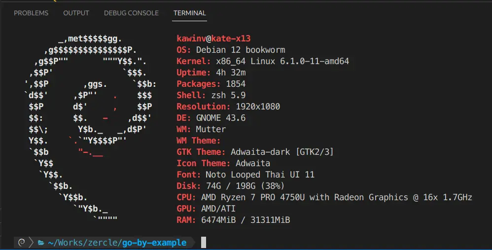
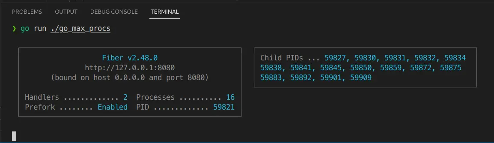
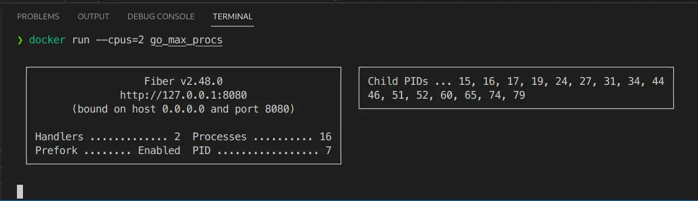
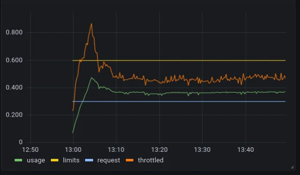
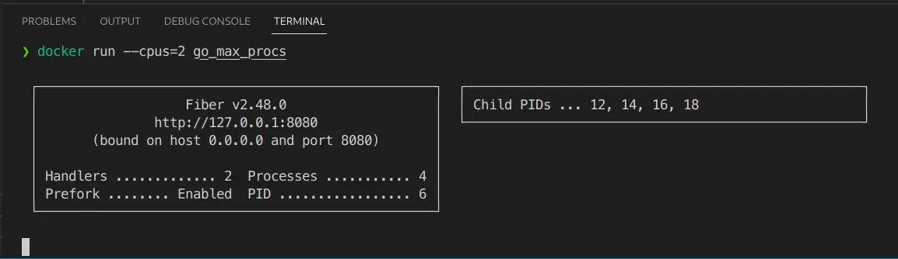
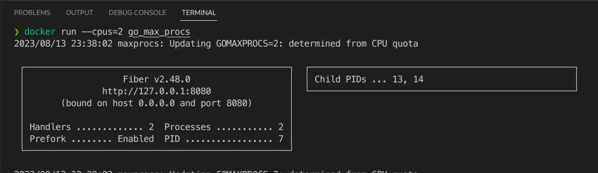

Since Go 1.5, the number of `User-Level` threads that a Go App can run concurrently in each instance is determined by GOMAXPROCS. The value of GOMAXPROCS is defined as follows:

GOMAXPROCS sets the maximum number of CPUs that can be executing simultaneously and returns the previous setting. It defaults to the value of runtime.NumCPU. If n < 1, it does not change the current setting. This call will go away when the scheduler improves.

<!--more-->

## Let's try it out

It seems good that it's set to allow `Parallelism` (which is different from `Concurrency`. Concurrency is about dealing with multiple things at the same time, **but not necessarily simultaneously**. Parallelism is about **doing one or more things simultaneously**) according to the number of `logical CPUs`. But the problem arises when the app is running in a `Container` environment with a `CPU quota` set (which is normal for Ops to set to avoid interfering with other services). Our app doesn't set the GOMAXPROCS value based on the CPU quota from the container. Let's look at an example. Let's create a Go Fiber app that is [Prefork](https://github.com/gofiber/fiber/issues/180).

```go
func main() {

	// init fiber app
	app := fiber.New(fiber.Config{
		Prefork: true,
	})

	// simple get current CPU and Go MaxProcs
	app.Get("/", func(ctx *fiber.Ctx) error {
		respBody := fiber.Map{
			"NumCPU":     runtime.NumCPU(),
			"GOMAXPROCS": runtime.GOMAXPROCS(0),
		}
		return ctx.JSON(respBody)
	})

	// listen HTTP
	go func() {
		if err := app.Listen(":8080"); err != nil {
			log.Panic(err)
		}
	}()

	// listen for end signal
	quit := make(chan os.Signal, 1)
	signal.Notify(quit, os.Interrupt, syscall.SIGTERM)

	// block before gracefully shutdown
	<-quit
	fmt.Println("Gracefully shutting down...")
	_ = app.Shutdown()
}
```

The app runs on my machine with 16 logical CPU cores.


The Fiber app will spawn itself and its children into 16 processes.


Now let's try it through a Container with a CPU quota set.


What the... it still has 16 processes. It turns out that it still spawns processes beyond the given quota.

## What's the problem?
So what's the problem? It doesn't seem like a big deal, just a lot of processes. But imagine this: you have 2 workers, but you give them a task for 16 people to do at the same time. What will happen? That's right, latency. Because when there's more work than the workforce can handle, something called `CPU throttling` occurs, which slows everything down. The graph below shows an example of when the CPU is throttled after working beyond its quota, being pushed down far below the limit.


## The solution
### Set it via GOMAXPROCS
The straightforward way is to set GOMAXPROCS directly in the code.
```go
func main() {
  runtime.GOMAXPROCS(4)

  ...
}
```
After setting the value in `runtime.GOMAXPROCS()`, let's run it in the container.

We find that the number of processes spawned is as set in the code, but it still doesn't match the container's value.

### Set it via uber-go/automaxprocs
So, a village representative came to solve this problem, and that is Uber's [uber-go/automaxprocs](https://github.com/uber-go/automaxprocs). It's very easy to use, just add the import pkg to the main function.
```go
import (
  _ "go.uber.org/automaxprocs"
)

func main() {
  ...
}
```

The result will be as set in the CPU quota. Now our app will not spawn processes beyond the container's CPU quota, and our app will run smoothly without unintentional CPU throttling.

