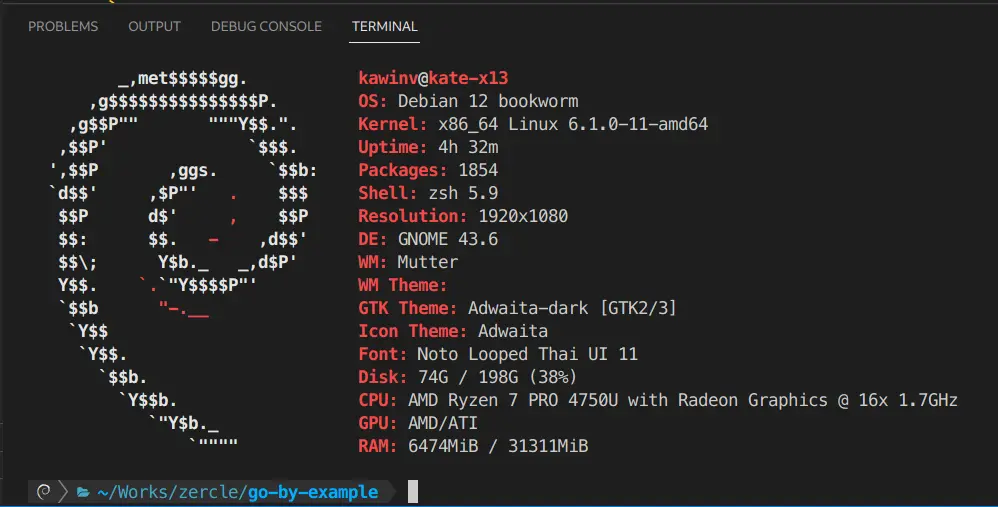
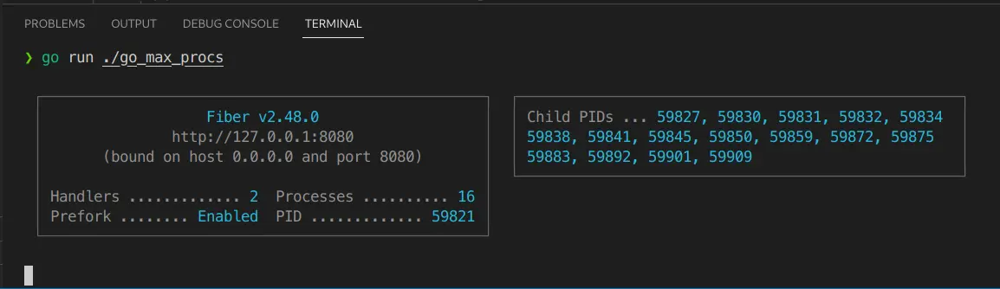
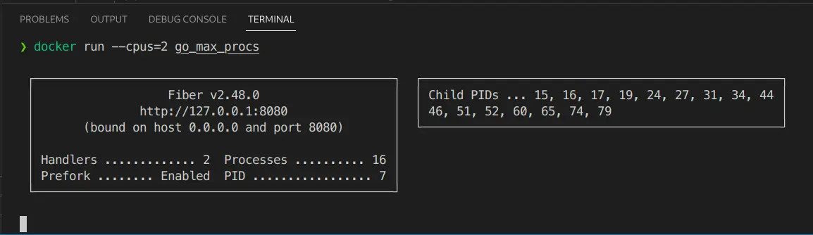
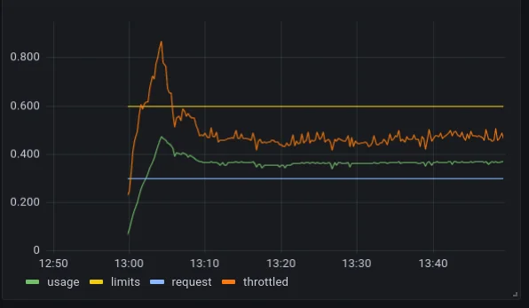
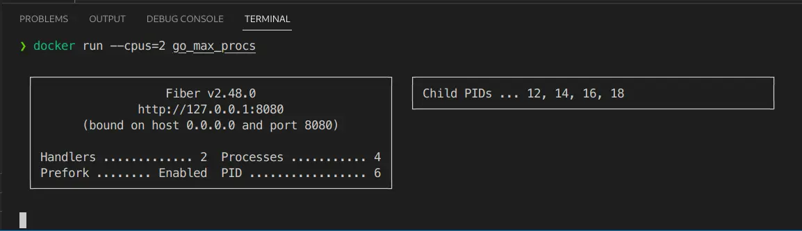
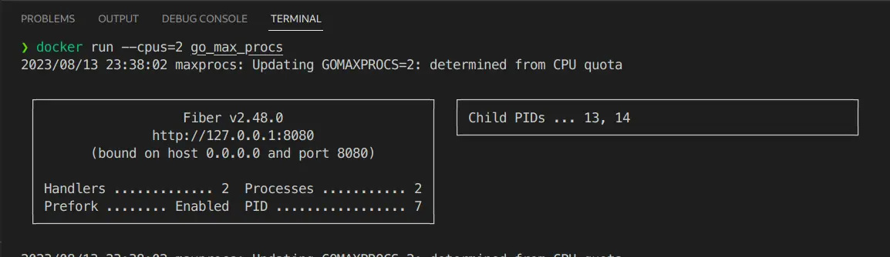

ตั้งแต่ Go 1.5 เป็นต้นมานั้น ค่าของจำนวน `User-Level` ที่ Go App จะสามารถให้ทำงานพร้อมกันนั้นในแต่ละ Instance จะถูกกำหนดด้วย GOMAXPROCS แล้วทีนี้ค่าของ GOMAXPROCS จะมีค่าตามนิยามนี้

GOMAXPROCS sets the maximum number of CPUs that can be executing simultaneously and returns the previous setting. It defaults to the value of runtime.NumCPU. If n < 1, it does not change the current setting. This call will go away when the scheduler improves.

<!--more-->

## ลองใช้งานดู
ซึ่งก็เหมือนจะดูดีที่กำหมดมาให้ว่าสามารถทำงานแบบ `Parallelism` (คนละอันกับ `Concurrency` นะ Concurrency คือ จัดการกับงานหลายอย่างในช่วงเวลาเดียวกัน**แต่ไม่จำเป็นต้องพร้อมกัน** Parallelism คือ **ทำงานงานเดียวหรือหลายงานพร้อมกัน**) ได้ตามจำนวน `logical CPU` แต่ปัญหาจะเกิดเมื่อแอปไม่ได้ทำงานอยู่บนสภาพแวดล้อมที่เป็น `Container` แล้วกำหนด `CPU quota` ไว้ (ซึ่งก็ปกติ Ops จะกำหนดไว้อยู่แล้วเพื่อไม่ให้ไปเบียดกับ services อื่น ๆ) แอปเรามันดันไม่ได้กำหนดค่า GOMAXPROCS ด้วย CPU quota ที่กำหนดมาจาก container นี่สิ ดูได้จากตัวอย่าง ลองสร้าง Go fiber ขึ้มมาแอปนึง ที่เป็นแบบ [Prefork](https://github.com/gofiber/fiber/issues/180)

```go
func main() {

	// init fiber app
	app := fiber.New(fiber.Config{
		Prefork: true,
	})

	// simple get current CPU and Go MaxProcs
	app.Get("/", func(ctx *fiber.Ctx) error {
		respBody := fiber.Map{
			"NumCPU":     runtime.NumCPU(),
			"GOMAXPROCS": runtime.GOMAXPROCS(0),
		}
		return ctx.JSON(respBody)
	})

	// listen HTTP
	go func() {
		if err := app.Listen(":8080"); err != nil {
			log.Panic(err)
		}
	}()

	// listen for end signal
	quit := make(chan os.Signal, 1)
	signal.Notify(quit, os.Interrupt, syscall.SIGTERM)

	// block before gracefully shutdown
	<-quit
	fmt.Println("Gracefully shutting down...")
	_ = app.Shutdown()
}
```

แอปรันบนเครื่องผมที่มี 16 logical CPU cores


Fiber app ก็จะงอกตัวเองและลูก ๆ ขึ้นมา 16 processes


แล้วมาลองแบบผ่าน Container แบบกำหนด CPU quota ดู


ว้อททท มันก็ยังคงมี 16 processes ปรากฎว่ามันก็ยังงอก process ออกมาจนเกินที่ให้ quota ไว้

## ปัญหาคืออะไร
แล้วทีนี้ปัญหาคืออะไร มันก็ไม่เห็นเป็นไรนิก็แค่งอก process ออกมาเยอะเฉย ๆ  แต่ลองนึกสภาพดูนะครับว่ามีคนทำงาน 2 คน แต่เอางานขนาด 16 คน มาให้ทำทีเดียว**พร้อมกัน**จะเกิดอะไรขึ้น ใช่แล้วครับ มันความล่าช้าหรือ latency นั่นแหละ เพราะว่าเมื่อมีงานที่ต้องทำเกินกว่าแรงงานที่ทำได้จะเกิดสิ่งที่เรียกว่า `CPU throttling` ทำให้ทุกสิ่งอย่างล้าช้าลงไป จากกราฟด้านล่าง เป็นตัวอย่างเวลาที่ CPU โดนบีบลงมา หลังจากทำงานจนล้น quota โดยโดนกดลงมาจนต่ำกว่า limit เยอะเลย


## วิธีแก้
### กำหนดผ่าน GOMAXPROCS
วิธีตรงไปตรงมาก็คือ กำหนด GOMAXPROCS มันเลยในโค้ดนี่แหละ
```go
func main() {
  runtime.GOMAXPROCS(4)

  ...
}
```
หลังจากกำหนดค่าใน `runtime.GOMAXPROCS()` แล้วลองรันใน container ดู

ก็พบว่ามี process งอกออกมาเท่าที่ตามตั้งไว้ในโค้ดแล้ว แต่ก็ยังไม่ตรงกับค่าของ container อยู่ดี

### กำหนดผ่าน uber-go/automaxprocs
จึงมีตัวแทนหมู่บ้านมาแก้ขัดปัญหานี้ นั้นคือ uber นั่นเอง [uber-go/automaxprocs](https://github.com/uber-go/automaxprocs) วิธีใช้ก็ง่ายมากเพียงแค่เพิ่ม import pkg เข้ามาใน main เท่านั้น
```go
import (
  _ "go.uber.org/automaxprocs"
)

func main() {
  ...
}
```

ก็จะได้ผลออกมาตามที่กำหนดไว้ใน CPU quota เลย ทีนี้แอปของเราก็จะงอก process ไม่เกิน CPU quota ของ container แอปเราก็จะทำงานได้โดยสะดวกแล้ว
