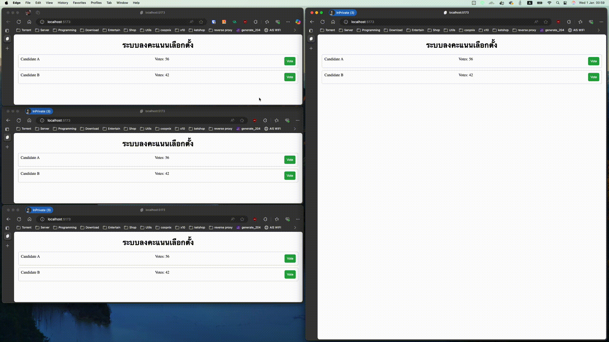

ช่วงนี้เห็นมีหาเสียงเลือกตั้งองค์กรปกครองส่วนท้องถิ่นกัน เลยถือโอกาสหยิบเว็บเทคโนโลยีนึงที่เหมือนจะถูกมองข้ามเช่น Server-Sent Events (SSE) มาสร้างเป็นระบบลงคะแนนเสียงแบบออนไลน์ที่รองรับการแสดงผลคะแนนแบบเรียลไทม์อย่างง่ายโดยใช้ภาษา **Go** สำหรับ backend และ **Svelte** สำหรับ frontend ดู

<!--more-->

## Server-Sent Events

ตามปกติแล้ว หน้าเว็บจะต้องส่งคำขอไปยัง Server เพื่อรับข้อมูลใหม่ นั่นคือ หน้าเว็บจะขอข้อมูลจาก Server แต่ด้วย Server-Sent Events (SSE) ช่วยให้ Server สามารถส่งข้อมูลไปยัง Client แบบ Real-Time ผ่านโปรโตคอล HTTP (PUSH) โดยไม่ต้องมีการร้องขอข้อมูลในทุกครั้งจาก Client ซึ่งแตกต่างจาก WebSocket ที่เปิดการเชื่อมต่อแบบสองทาง (full-duplex) SSE จะส่งข้อมูลจาก Server ไปยัง Client เพียงทางเดียว (one-way)


graph TD;
    A[Client] -->|HTTP Request| B[Server]
    B -->|HTTP Header| F[Content-Type: text/event-stream]
    F -->|HTTP Response| A
    B -->|Sends Events| C[Event Stream]
    C -->|Updates| A
    A -->|Handles Events| D[JavaScript Event Listener]
    D -->|Processes Data| E[Update UI]


### หลักการทำงานของ SSE
1. การสร้างการเชื่อมต่อ: เมื่อ Client ต้องการรับข้อมูลจาก Server ก็จะส่งคำขอ HTTP แบบ GET ไปยัง Server
2. การส่งข้อมูล: Server จะตอบสนองด้วยการส่งข้อมูลในรูปแบบของ event stream โดยใช้ header `Content-Type: text/event-stream`
3. การอัปเดตข้อมูล: Server จะส่งข้อมูล (events) ไปยัง Client อย่างต่อเนื่อง เมื่อมีข้อมูลใหม่เกิดขึ้น
4. การจัดการข้อมูลที่ได้รับ: Client จะใช้ JavaScript ในการรอรับ event (event listener) และทำการประมวลผลข้อมูลที่ได้รับ เพื่อนำไปอัปเดต UI หรือทำงานอื่น ๆ ต่อไป

## อธิบายฟังก์ชันใน Go

### 1. `NewVoteManager()`

ฟังก์ชันนี้เป็นตัวสร้าง (`constructor`) สำหรับสร้าง `VoteManager` ใหม่ ซึ่งจะมีค่าเริ่มต้นสำหรับผู้สมัครและช่องทางการลงคะแนนเสียง

```go
func NewVoteManager() *VoteManager {
    vm := &VoteManager{
        candidates: map[string]*Candidate{
            "Candidate A": {Name: "Candidate A", Votes: 0},
            "Candidate B": {Name: "Candidate B", Votes: 0},
        },
        voteChannel: make(chan string, runtime.NumCPU()*2),
        clients:     make(map[chan string]struct{}),
        cliRequests: make(chan cliRequest),
    }
    go vm.manageClients()
    return vm
}
```

**การทำงาน**: เมื่อเซิร์ฟเวอร์เริ่มทำงาน จะสร้าง `VoteManager` ซึ่งจะมีผู้สมัครสองคนคือ "Candidate A" และ "Candidate B" ที่มีคะแนนเริ่มต้นเป็น 0

---

### 2. `Start()`

ฟังก์ชันนี้เริ่มต้นการทำงานของ `VoteManager` โดยเปิด `goroutine` เพื่อรอรับการลงคะแนนเสียงจากช่องทาง `voteChannel`

```go
func (vm *VoteManager) Start(ctx context.Context) {
    vm.wg.Add(1)
    go func() {
        defer vm.wg.Done()
        for {
            select {
            case candidateName, ok := <-vm.voteChannel:
                if !ok {
                    return
                }
                vm.processVote(candidateName)
            case <-ctx.Done():
                return
            }
        }
    }()
}
```

**การทำงาน**: เมื่อมีการเรียกใช้ฟังก์ชันนี้ เซิร์ฟเวอร์จะเริ่มรับการลงคะแนนเสียงจากผู้ใช้ หากผู้ใช้ลงคะแนนเสียง "Candidate A" เซิร์ฟเวอร์จะส่งชื่อผู้สมัครนี้ไปยังฟังก์ชัน `processVote`

---

### 3. `processVote()`

ฟังก์ชันนี้ทำหน้าที่ตรวจสอบว่าผู้สมัครที่ได้รับการลงคะแนนเสียงนั้นมีอยู่ในระบบหรือไม่ และจะเพิ่มคะแนนให้กับผู้สมัครที่ตรงกับชื่อที่ได้รับ

```go
func (vm *VoteManager) processVote(candidateName string) {
    if candidate, exists := vm.candidates[candidateName]; exists {
        candidate.Votes++
        vm.notifyClients(candidate)
    } else {
        log.Printf("Received vote for unknown candidate: %s", candidateName)
    }
}
```

**การทำงาน**: หากมีการลงคะแนนเสียงให้กับ "Candidate A" คะแนนจะเพิ่มจาก 0 เป็น 1 และจะมีการแจ้งเตือนผู้ใช้ทั้งหมดเกี่ยวกับคะแนนใหม่ ซึ่งจะบวกค่าไปเรื่อย ๆ หากมีการลงคะแนนเสียงให้กับผู้สมัคร

---

### 4. `notifyClients()`

ฟังก์ชันนี้ทำหน้าที่ส่งข้อมูลคะแนนที่อัปเดตให้กับผู้ใช้ทุกคนที่เชื่อมต่ออยู่

```go
func (vm *VoteManager) notifyClients(candidate *Candidate) {
    message, err := json.Marshal(candidate)
    if err != nil {
        log.Printf("Failed to marshal candidate: %v", err)
        return
    }

    for clientChan := range vm.clients {
        select {
        case clientChan <- string(message):
        default:
            log.Println("Skipping sending to a slow client")
        }
    }
}
```

**การทำงาน**: เมื่อคะแนนของ "Candidate A" เพิ่มขึ้น ฟังก์ชันนี้จะส่งข้อมูลคะแนนใหม่ไปยังผู้ใช้ทุกคนผ่านช่องทางที่เชื่อมต่ออยู่ว่าปัจจุบัน "Candidate A" มีผลคะแนะนเป็นเท่าไร

---

### 5. `voteHandler()`

ฟังก์ชันนี้รับผิดชอบในการจัดการคำขอการลงคะแนนเสียงจากผู้ใช้ โดยจะรับชื่อผู้สมัครจากพารามิเตอร์ใน URL

```go
func (vm *VoteManager) voteHandler(w http.ResponseWriter, r *http.Request) {
    candidateName := r.URL.Query().Get("candidate")
    if candidateName == "" {
        http.Error(w, "Candidate name is required", http.StatusBadRequest)
        return
    }
    select {
    case vm.voteChannel <- candidateName:
        w.WriteHeader(http.StatusAccepted)
    default:
        http.Error(w, "Server is busy, try again later", http.StatusServiceUnavailable)
    }
}
```

**การทำงาน**: หากผู้ใช้ส่งคำขอ `GET` ไปที่ `/vote?candidate=Candidate A` ฟังก์ชันนี้จะส่งชื่อ "Candidate A" ไปยังช่อง `voteChannel` และส่งกลับสถานะ 202 (Accepted) หากเซิร์ฟเวอร์ไม่สามารถรับคะแนนได้ จะส่งกลับสถานะ 503 (Service Unavailable)

---

### 6. `resultsHandler()`

ฟังก์ชันนี้ทำหน้าที่ส่งคืนผลคะแนนที่ปัจจุบันของผู้สมัครทั้งหมดในรูปแบบ JSON

```go
func (vm *VoteManager) resultsHandler(w http.ResponseWriter, r *http.Request) {
    candidateList := make([]*Candidate, 0, len(vm.candidates))
    for _, candidate := range vm.candidates {
        c := &Candidate{
            Name:  candidate.Name,
            Votes: candidate.Votes,
        }
        candidateList = append(candidateList, c)
    }
    if err := json.NewEncoder(w).Encode(candidateList); err != nil {
        http.Error(w, "Failed to encode results", http.StatusInternalServerError)
    }
}
```

**การทำงาน**: เมื่อผู้ใช้เข้าถึง `/results` เซิร์ฟเวอร์จะส่งข้อมูล JSON ของผู้สมัครทั้งหมดและคะแนนของพวกเขา เช่น:

```json
[
    {"name": "Candidate A", "votes": 1},
    {"name": "Candidate B", "votes": 0}
]
```

---

### 7. `sseHandler()`

ฟังก์ชันนี้ใช้สำหรับจัดการการเชื่อมต่อ Server-Sent Events (SSE) เพื่อให้ผู้ใช้สามารถรับข้อมูลแบบเรียลไทม์

```go
func (vm *VoteManager) sseHandler(w http.ResponseWriter, r *http.Request) {
    w.Header().Set("Content-Type", "text/event-stream")
    w.Header().Set("Cache-Control", "no-cache")
    w.Header().Set("Connection", "keep-alive")

    flusher, ok := w.(http.Flusher)
    if !ok {
        http.Error(w, "Streaming unsupported!", http.StatusInternalServerError)
        return
    }

    clientChan := make(chan string, runtime.NumCPU()*2)
    vm.AddClient(clientChan)
    defer vm.RemoveClient(clientChan)

    initialData, err := json.Marshal(vm.candidates)
    if err == nil {
        w.Write([]byte("data: " + string(initialData) + "\n\n"))
        flusher.Flush()
    }

    notify := r.Context().Done()
    pingTicker := time.NewTicker(1 * time.Minute)
    defer pingTicker.Stop()

    for {
        select {
        case msg, ok := <-clientChan:
            if !ok {
                return
            }
            if _, err := w.Write([]byte("data: " + msg + "\n\n")); err != nil {
                log.Println("Error writing to client:", err)
                return
            }
            flusher.Flush()

        case <-notify:
            return

        case <-pingTicker.C:
            if _, err := w.Write([]byte(":\n\n")); err != nil {
                log.Println("Error during ping:", err)
                return
            }
            flusher.Flush()
        }
    }
}
```

**การทำงาน**: เมื่อลูกค้าสร้างการเชื่อมต่อกับ `/events` เซิร์ฟเวอร์จะส่งข้อมูลผู้สมัครทั้งหมดในรูปแบบ JSON ให้กับลูกค้าและยังส่งข้อมูลคะแนนที่อัปเดตเมื่อมีการลงคะแนนเสียงใหม่

---

## อธิบายฟังก์ชันใน Svelte

### 1. `fetchResults()`

ฟังก์ชันนี้ใช้สำหรับดึงข้อมูลคะแนนของผู้สมัครจากเซิร์ฟเวอร์

```javascript
async function fetchResults() {
    loading = true;
    try {
        const response = await axios.get("http://localhost:8080/results");
        candidates = response.data.sort((a, b) => a.name.toLowerCase().localeCompare(b.name.toLowerCase()));
    } catch (error) {
        errorMessage = "Error fetching results. Please try again later.";
        console.error("Error fetching results:", error);
    } finally {
        loading = false;
    }
}
```

**การทำงาน**: เมื่อโหลดหน้าเว็บ ฟังก์ชันนี้จะถูกเรียกเพื่อดึงข้อมูลคะแนนผู้สมัคร และเก็บในตัวแปร `candidates` เพื่อแสดงผล

---

### 2. `vote()`

ฟังก์ชันนี้จะถูกเรียกเมื่อผู้ใช้คลิกปุ่มลงคะแนนเสียง

```javascript
async function vote(candidate) {
    voting = true;
    errorMessage = "";
    try {
        await axios.get(`http://localhost:8080/vote?candidate=${candidate}`);
        voted = true;
        setTimeout(() => {
            voted = false;
        }, 5000);
    } catch (error) {
        errorMessage = "Error voting. Please try again.";
        console.error("Error voting:", error);
    } finally {
        voting = false;
    }
}
```

**การทำงาน**: หากผู้ใช้คลิกลงคะแนนเสียงให้กับ "Candidate A" ฟังก์ชันนี้จะส่งคำขอไปยังเซิร์ฟเวอร์และตั้งค่าตัวแปร `voted` เป็น `true` เพื่อป้องกันการลงคะแนนซ้ำในช่วงเวลา 5 วินาที จำลองว่ามี user ใหม่เข้ามาลงคะแนน

---

### 3. `setupSSE()`

ฟังก์ชันนี้ใช้สำหรับตั้งค่าการเชื่อมต่อ SSE เพื่อรับข้อมูลคะแนนแบบเรียลไทม์

```javascript
function setupSSE() {
    const eventSource = new EventSource("http://localhost:8080/events");

    eventSource.onmessage = function (event) {
        const updatedCandidate = JSON.parse(event.data);
        const index = candidates.findIndex(c => c.name === updatedCandidate.name);
        if (index !== -1) {
            candidates[index].votes = updatedCandidate.votes;
        }
    };

    eventSource.onerror = function (err) {
        console.error("EventSource failed:", err);
        eventSource.close();
    };
}
```

**การทำงาน**: เมื่อมีการเปลี่ยนแปลงคะแนน ฟังก์ชันนี้จะได้รับข้อมูลคะแนนที่อัปเดตจากเซิร์ฟเวอร์และทำการอัปเดต `candidates` ใน UI โดยอัตโนมัติ

---

### ตัวอย่างการทำงาน



## สรุป

เราสามารถเอา SSE มาประยุกต์ใช้งานกับการแสดงผลแบบ Real-time แบบง่าย เช่นการอัปเดตผลคะแนนด้วยการอาศัย Push ข้อมูลใหม่มาจากฝั่ง Server ทำให้ไม่ต้องวน Refresh ข้อมูลใหม่มาจากฝั่ง Client และไม่ต้องเปิด Websocket ด้วย สามารถดูโค้ด ตัวอย่าง เต็ม ๆ ได้ที่ [bouroo/sse-voting-app](https://github.com/bouroo/sse-voting-app)