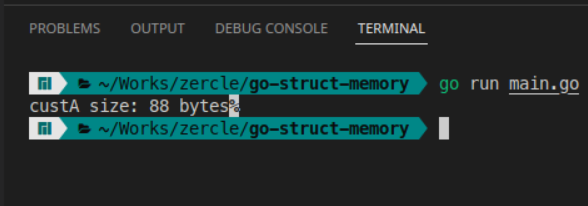
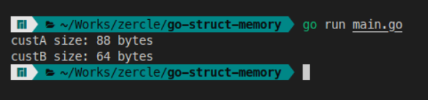
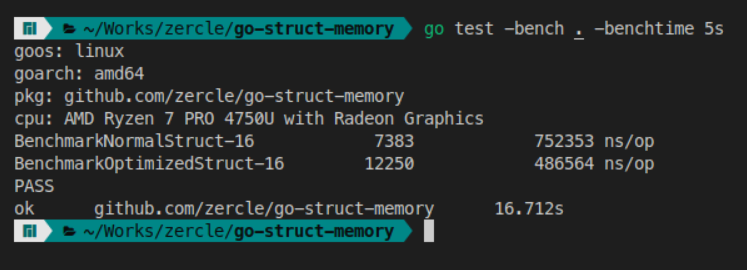

When I was studying computer engineering, a question that always came up was why we needed to study subjects like Computer Architecture and Data Structures. It wasn't until I graduated and started writing in Go that I realized why Go has data types with specific sizes, such as `int8`, `int16`, `int32`, `int64`, and others. Why not just have `int` or `number` like in lazy languages like TypeScript? It was only after reading about [sizes in Go](https://go.dev/src/go/types/sizes.go) that I realized we can use our knowledge of Computer Architecture and Data Structures to help us write Go code that is as efficient as it should be.

<!--more-->

## Reviewing System Architecture Knowledge

### Word size
Word size is the amount of data that a CPU's registers can store and process in one cycle, which varies depending on the CPU architecture.
- 32-bit has a word size of 4 bytes.
- 64-bit has a word size of 8 bytes.

### Memory allocation
Memory allocation is the reservation of space in memory. This involves reserving the actual space needed plus additional space to fill up the word size.

### Sizes of Data Types in Go
In Go, each data type has a different memory size. You can check this with `unsafe.Sizeof()`.

## Go struct
A Go struct is a way to create a data structure in Go, for example:

```go
type Customer struct {
	Id         uint64 // 8 bytes
	FaceId     uint32 // 4 bytes
	Name       string // 16 bytes
	Age        uint8  // 1 byte
	Address    string // 16 bytes
	PhoneId    uint16 // 2 bytes
	PassportId string // 16 bytes
	IsActive   bool   // 1 byte
}
```

The total size of all the types in the struct is 64 bytes. Let's see how much memory the entire struct takes up.

```go
cusA = Customer{}
fmt.Printf("custA size: %d bytes\n", unsafe.Sizeof(custA))
```



The result is 88 bytes. What happened? Let's take a look.

| **word / byte** | **1**      | **2**      | **3**      | **4**      | **5**      | **6**      | **7**      | **8**      |
|-----------------|------------|------------|------------|------------|------------|------------|------------|------------|
| **word 1**      | Id         | Id         | Id         | Id         | Id         | Id         | Id         | Id         |
| **word 2**      | FaceId     | FaceId     | FaceId     | FaceId     |            |            |            |            |
| **word 3**      | Name       | Name       | Name       | Name       | Name       | Name       | Name       | Name       |
| **word 4**      | Name       | Name       | Name       | Name       | Name       | Name       | Name       | Name       |
| **word 5**      | Age        |            |            |            |            |            |            |            |
| **word 6**      | Address    | Address    | Address    | Address    | Address    | Address    | Address    | Address    |
| **word 7**      | Address    | Address    | Address    | Address    | Address    | Address    | Address    | Address    |
| **word 8**      | PhoneId    | PhoneId    |            |            |            |            |            |            |
| **word 9**      | PassportId | PassportId | PassportId | PassportId | PassportId | PassportId | PassportId | PassportId |
| **word 10**     | PassportId | PassportId | PassportId | PassportId | PassportId | PassportId | PassportId | PassportId |
| **word 11**     | IsActive   |            |            |            |            |            |            |            |

### optimized
We can see that there is padding in each word. We can optimize this like so:

```go
type CustomerOptimized struct {
	Id         uint64 // 8 bytes
	Name       string // 16 bytes
	Address    string // 16 bytes
	PassportId string // 16 bytes
	FaceId     uint32 // 4 bytes
	PhoneId    uint16 // 2 bytes
	Age        uint8  // 1 byte
	IsActive   bool   // 1 byte
}

custA := Customer{}
fmt.Printf("custA size: %d bytes\n", unsafe.Sizeof(custA))

custB := CustomerOptimized{}
fmt.Printf("custB size: %d bytes\n", unsafe.Sizeof(custB))
```

Let's see the results before and after.



Done! We got 64 bytes. The memory layout looks something like this:

| **word / byte** | **1**      | **2**      | **3**      | **4**      | **5**      | **6**      | **7**      | **8**      |
|-----------------|------------|------------|------------|------------|------------|------------|------------|------------|
| **word 1**      | Id         | Id         | Id         | Id         | Id         | Id         | Id         | Id         |
| **word 2**      | Name       | Name       | Name       | Name       | Name       | Name       | Name       | Name       |
| **word 3**      | Name       | Name       | Name       | Name       | Name       | Name       | Name       | Name       |
| **word 4**      | Address    | Address    | Address    | Address    | Address    | Address    | Address    | Address    |
| **word 5**      | Address    | Address    | Address    | Address    | Address    | Address    | Address    | Address    |
| **word 6**      | PassportId | PassportId | PassportId | PassportId | PassportId | PassportId | PassportId | PassportId |
| **word 7**      | PassportId | PassportId | PassportId | PassportId | PassportId | PassportId | PassportId | PassportId |
| **word 8**      | FaceId     | FaceId     | FaceId     | FaceId     | PhoneId    | PhoneId    | Age        | IsActive   |
| **word 9**      |            |            |            |            |            |            |            |            |
| **word 10**     |            |            |            |            |            |            |            |            |
| **word 11**     |            |            |            |            |            |            |            |            |

We saved 3 words!

## benchmark

Let's see how much of a difference it makes.



|                      | **iteration (round/5s)** | **exec time (ns/op)** |
|----------------------|--------------------------|-----------------------|
| **Normal struct**    | 7,383                    | 752,353               |
| **Optimized struct** | 12,250                   | 486,464               |

## fieldalignment
So, do we have to arrange our structs ourselves? The answer is yes, but we have a convenient tool for that: [govet/fieldalignment](https://pkg.go.dev/golang.org/x/tools/go/analysis/passes/fieldalignment). Here's how to use it:

```bash
go install golang.org/x/tools/go/analysis/passes/fieldalignment/cmd/fieldalignment@latest

fieldalignment -fix ./...
```

Finally, don't forget to always arrange your Go structs and use data types only as needed (using a fieldalignment in a pre-commit script is also convenient).
