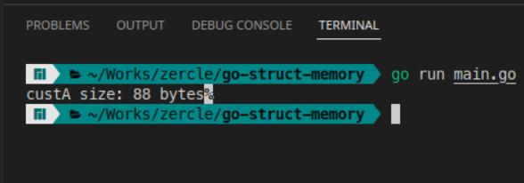
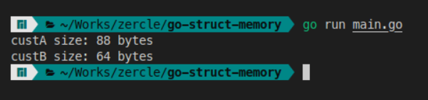
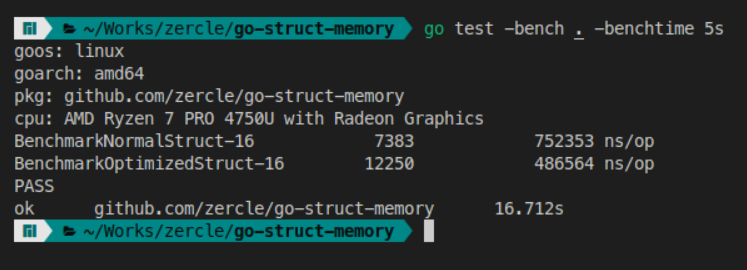

ตอนสมัยเรียนวิศวคอมพิวเตอร์มีคำถามนึงโผล่มาเสมอว่าวิชาอย่าง Computer Architecture กับ Data Structure เรียนไปทำไมกันนะ จนกระทั้งจบออกมาได้เขียนภาษา Go ถึงได้เอะใจว่า ทำไม Go ถึงได้มี data type แบบกำหนดขนาด เช่น `int8` `int16` `int32` `int64` และอื่น ๆ ทำไมถึงไม่เป็น `int` หรือ `number` เฉย ๆ ไปเลยแบบภาษาขี้เกียจอย่าง TypeScript กันนะ จนได้มานั่งอ่านเกี่ยวกับ [sizes in Go](https://go.dev/src/go/types/sizes.go) ถึงได้รู้ว่าเราสามารถใช้ความรู้ในวิชา Computer Architecture และ Data Structure มาช่วยให้เราเขียน Go ออกมาได้ประสิทธิภาพอย่างที่ควรจะเป็น

<!--more-->

## ทบทวนความรู้ System Architecture

### Word size
word size คือ ปริมาณของข้อมูลที่ registers ของ CPU สามารถเก็บและนำมาประมวลผลได้ในหนึ่งรอบซึ่งจะต่างกันตามแต่สถาปัตยกรรมของ CPU
- 32 bit มี word size ที่ 4 bytes
- 64 bit มี word size ที่ 8 bytes

### Memory allocation
Memory allocation คือ การจองพื้นที่ในหน่วยความจำนั่นเอง ซึ่งจะเป็นการจองพื้นที่ใช้งานจริง + พื้นที่ส่วนเพิ่มเพื่อให้เต็ม word size

### Sizes ของ Data Type ใน Go
ใน Go แต่ละ data type จะมีขนาดที่ใช้หน่วยความจำแตกต่างกัน [sizes in Go](https://go.dev/src/go/types/sizes.go) ซึ่งเราสามารถดูได้จาก `unsafe.Sizeof()`

## Go struct
Go struct คือการสร้าง structure ของ data ใน Go เช่น

```go
type Customer struct {
	Id         uint64 // 8 bytes
	FaceId     uint32 // 4 bytes
	Name       string // 16 bytes
	Age        uint8  // 1 byte
	Address    string // 16 bytes
	PhoneId    uint16 // 2 bytes
	PassportId string // 16 bytes
	IsActive   bool   // 1 byte
}
```

จาก type ใน struct ทั้งหมดก็ 64 bytes แล้วเรามาดูขนาดของของหน่วยความจำทั้ง struct กันว่าเป็นเท่าไหร่

```go
cusA = Customer{}
fmt.Printf("custA size: %d bytes\n", unsafe.Sizeof(custA))
```



ผลคือ 88 bytes ว้อททท เกิดอะไรขึ้นมาดูกัน

| **word / byte** | **1**      | **2**      | **3**      | **4**      | **5**      | **6**      | **7**      | **8**      |
|-----------------|------------|------------|------------|------------|------------|------------|------------|------------|
| **word 1**      | Id         | Id         | Id         | Id         | Id         | Id         | Id         | Id         |
| **word 2**      | FaceId     | FaceId     | FaceId     | FaceId     |            |            |            |            |
| **word 3**      | Name       | Name       | Name       | Name       | Name       | Name       | Name       | Name       |
| **word 4**      | Name       | Name       | Name       | Name       | Name       | Name       | Name       | Name       |
| **word 5**      | Age        |            |            |            |            |            |            |            |
| **word 6**      | Address    | Address    | Address    | Address    | Address    | Address    | Address    | Address    |
| **word 7**      | Address    | Address    | Address    | Address    | Address    | Address    | Address    | Address    |
| **word 8**      | PhoneId    | PhoneId    |            |            |            |            |            |            |
| **word 9**      | PassportId | PassportId | PassportId | PassportId | PassportId | PassportId | PassportId | PassportId |
| **word 10**     | PassportId | PassportId | PassportId | PassportId | PassportId | PassportId | PassportId | PassportId |
| **word 11**     | IsActive   |            |            |            |            |            |            |            |

### optimized
จะเห็นว่ามีช่อง padding ของในแต่ละ word ทีนี้เราก็สามารถ optimize ได้แบบนี้

```go
type CustomerOptimized struct {
	Id         uint64 // 8 bytes
	Name       string // 16 bytes
	Address    string // 16 bytes
	PassportId string // 16 bytes
	FaceId     uint32 // 4 bytes
	PhoneId    uint16 // 2 bytes
	Age        uint8  // 1 byte
	IsActive   bool   // 1 byte
}

custA := Customer{}
fmt.Printf("custA size: %d bytes\n", unsafe.Sizeof(custA))

custB := CustomerOptimized{}
fmt.Printf("custB size: %d bytes\n", unsafe.Sizeof(custB))
```

มาดูผลงานกันระหว่างก่อนและหลังกันนน



เรียบร้อยโรงเรียน KKU ได้ 64 bytes แล้ว ซึ่งหน้าตาใน memory ก็จะประมาณนี้

| **word / byte** | **1**      | **2**      | **3**      | **4**      | **5**      | **6**      | **7**      | **8**      |
|-----------------|------------|------------|------------|------------|------------|------------|------------|------------|
| **word 1**      | Id         | Id         | Id         | Id         | Id         | Id         | Id         | Id         |
| **word 2**      | Name       | Name       | Name       | Name       | Name       | Name       | Name       | Name       |
| **word 3**      | Name       | Name       | Name       | Name       | Name       | Name       | Name       | Name       |
| **word 4**      | Address    | Address    | Address    | Address    | Address    | Address    | Address    | Address    |
| **word 5**      | Address    | Address    | Address    | Address    | Address    | Address    | Address    | Address    |
| **word 6**      | PassportId | PassportId | PassportId | PassportId | PassportId | PassportId | PassportId | PassportId |
| **word 7**      | PassportId | PassportId | PassportId | PassportId | PassportId | PassportId | PassportId | PassportId |
| **word 8**      | FaceId     | FaceId     | FaceId     | FaceId     | PhoneId    | PhoneId    | Age        | IsActive   |
| **word 9**      |            |            |            |            |            |            |            |            |
| **word 10**     |            |            |            |            |            |            |            |            |
| **word 11**     |            |            |            |            |            |            |            |            |

ประหยัดกันไป 3 words กันเลยทีเดียว

## benchmark

แล้วมาดูกันว่ามันจะแตกต่างกันขนาดไหน



|                      | **iteration (round/5s)** | **exec time (ns/op)** |
|----------------------|--------------------------|-----------------------|
| **Normal struct**    | 7,383                    | 752,353               |
| **Optimized struct** | 12,250                   | 486,464               |

## fieldalignment
แล้วงี้เราก็ต้องมานั่งเรียง struct ของเราเองเลยหรอ คำตอบคือใช่ แต่เรามี tools อำนวยความสะดวกไว้ให้เราใช้แล้วก็คือ [govet/fieldalignment](https://pkg.go.dev/golang.org/x/tools/go/analysis/passes/fieldalignment) นั่นเอง ซึ่งวิธีใช้งานก็

```bash
go install golang.org/x/tools/go/analysis/passes/fieldalignment/cmd/fieldalignment@latest

fieldalignment -fix ./...
```

สุดท้ายนี้ก็อย่าลืมจัดเรียง Go struct และใช้ data type เท่าที่จำเป็นเสมอนะครับ (จะใช้วิธีเพิ่ม fieldalignment ใน precommit script ก็สะดวกนะเอ้อ)
