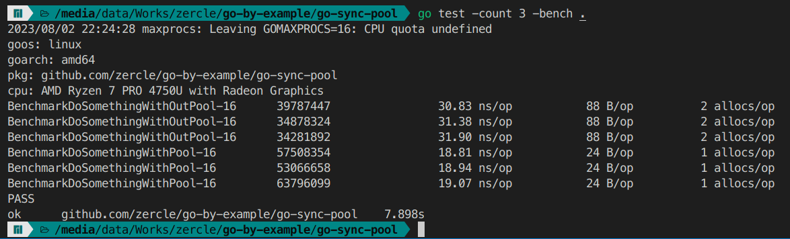

If you've written goroutines, you've probably come across `sync.WaitGroup` for waiting on a group of goroutines. But in the `sync` package, there's another useful type I'd like to introduce: `sync.Pool`, which helps reuse memory and reduce allocations for things that are used repeatedly.

<!--more-->

## How sync.Pool{} works
Let's look at how `sync.Pool{}` works. The pool has two baskets: the Pool and the Victim, for caching before being cleared by the garbage collector (GC).

### basic

Starting from nothing.
| Operation | Pool | Victim |          | caller |
|-----------|------|--------|----------|--------|
|           | 0    | 0      |          |        |

Getting from an empty Pool will allocate a new one.
| Operation | Pool | Victim |          | caller |
|-----------|------|--------|----------|--------|
| get       | 0    | 0      | allocate | 1      |

Then put it back into the Pool.
| Operation | Pool | Victim |          | caller |
|-----------|------|--------|----------|--------|
| put       | 1    | 0      | ←        | 0      |

The next user will get from the existing Pool.
| Operation | Pool | Victim |          | caller |
|-----------|------|--------|----------|--------|
| get       | 0    | 0      | →        | 1      |

### garbage collector

Before the garbage collector, everything is in the Pool.
| Operation | Pool | Victim |      | caller |
|-----------|------|--------|------|--------|
|           | 3    | 0      |      |        |

After the garbage collector, it will be moved to the Victim.
| Operation | Pool | Victim |      | caller |
|-----------|------|--------|------|--------|
| GC        | 0    | 3      |      |        |

If there is a get after the garbage collector, it will be taken from the Victim.
| Operation | Pool | Victim |      | caller |
|-----------|------|--------|------|--------|
| get       | 0    | 2      | →    | 1      |

When putting it back into the Pool.
| Operation | Pool | Victim |      | caller |
|-----------|------|--------|------|--------|
| put       | 1    | 2      | ←    | 0      |

After another garbage collector cycle, what's left in the Victim will be cleared out. What's in the Pool will wait in the Victim, and so on.
| Operation | Pool | Victim |      | caller |
|-----------|------|--------|------|--------|
| GC        | 0    | 1      |      |        |

## The structure of sync.Pool{}

This example is adapted from [sync example-Pool](https://pkg.go.dev/sync#example-Pool). `DoSomethingWithOutPool` is the traditional way without using a pool. `DoSomethingWithPool` uses a pool by putting it back into the pool after use. `DoSomethingWithPoolDefer` uses a pool by deferring putting it back into the pool after the function ends.

```go
var bufPool = sync.Pool{
	New: func() any {
		// The Pool's New function should generally only return pointer
		// types, since a pointer can be put into the return interface
		// value without an allocation:
		return new(bytes.Buffer)
	},
}

// timeNow is a fake version of time.Now for tests.
func timeNow() time.Time {
	return time.Unix(1690909200, 0)
}

func DoSomethingWithOutPool() {
	buff := new(bytes.Buffer)
	// write to buffer
	buff.WriteString(timeNow().UTC().Format(time.RFC3339))
	// discard for test
	io.Discard.Write(buff.Bytes())
	// clear buffer before return
	buff.Reset()
}

func DoSomethingWithPool() {
	buff := bufPool.Get().(*bytes.Buffer)
	// write to buffer
	buff.WriteString(timeNow().UTC().Format(time.RFC3339))
	// write from buffer to discard for test
	io.Discard.Write(buff.Bytes())
	// clear buffer before return to pool
	buff.Reset()
	bufPool.Put(buff)
}

func DoSomethingWithPoolDefer() {
	buff := bufPool.Get().(*bytes.Buffer)
	// clear buffer before return to pool after the end of function
	defer func() {
		buff.Reset()
		bufPool.Put(buff)
	}()
	// write to buffer
	buff.WriteString(timeNow().UTC().Format(time.RFC3339))
	// write from buffer to discard for test
	io.Discard.Write(buff.Bytes())
}
```
Comparing the results using `(*testing.B).RunParallel` to test in parallel.

As you can see, the time per operation, memory per operation, and allocations per operation are all about half. The lazy, play-it-safe way with defer takes slightly longer than putting it back manually because it has to wait for the function to finish before resetting and putting the buffer back in the pool.

## Advantages
- Concurrently safe, so it can be used in goroutines at the same time.
- Saves memory allocation by borrowing from the cache in the pool.

## Cautions
- Data in the pool is lost with each GC cycle (it's not there forever).
- If you don't `put` it back into the pool, every time you `get`, a new instance will be created, making the overall system more wasteful (because it has to allocate more heap space). A middle ground is to use `defer put` immediately after `get` to help you not forget to `put` it back into the pool.

## When should you use sync.Pool{}?
- As is typical for the sync package, use it in goroutines that repeatedly use the same methods so you don't have to waste memory allocating every time you loop.
- Use it for tasks that have a high initialization cost and are used frequently, such as `parser`, `reader`, `writer`, `buffer`, `network connection`, etc. (It's like, it's expensive to create, so I'll just borrow it and return it when I'm done).
  - For example, [ParserPool of valyala/fastjson](https://pkg.go.dev/github.com/valyala/fastjson#ParserPool)
