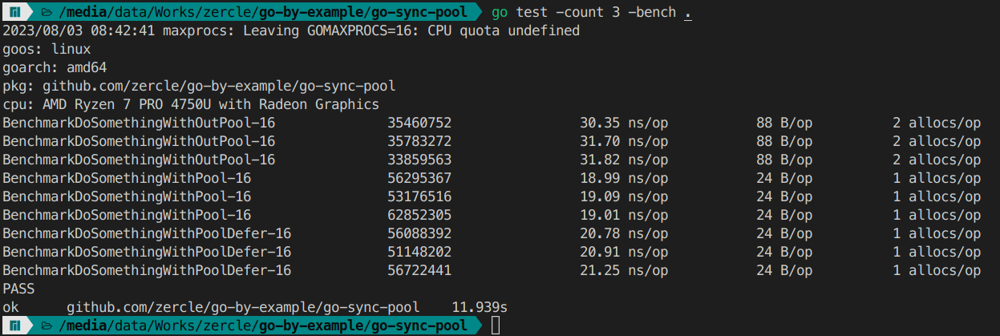

ถ้าใครเขียน goroutine ก็คงจะเคยพบเจอกับ `sync.WaitGroup` ที่ใช้ในการทำ wait group ให้ goroutine กันแล้ว แต่ใน pkg `sync` มี type นึงที่มีประโยชน์ในงานที่อยากจะมาแนะนำ คือ `sync.Pool` ที่จะมาช่วย re-use memory ลดการ allocate ที่ต้องใช้ของเดิมซ้ำ ๆ ได้

<!--more-->

## การทำงานของ sync.Pool{}
มาดูการทำงานของ `sync.Pool{}` ว่าทำงานยังไง โดย pool จะมี 2 ตะกร้าคือ Pool และ Victim สำหรับ cache ก่อนจะโดน garbage collector (GC) เคลียร์ออกไป

### basic

เริ่มต้น จากไม่มีอะไรเลย
| Operation | Pool | Victim |          | caller |
|-----------|------|--------|----------|--------|
|           | 0    | 0      |          |        |

get จาก Pool เปล่า จะเป็นการ allocate ให้ใหม่
| Operation | Pool | Victim |          | caller |
|-----------|------|--------|----------|--------|
| get       | 0    | 0      | allocate | 1      |

จากนั้นก็ put กลับคืน Pool
| Operation | Pool | Victim |          | caller |
|-----------|------|--------|----------|--------|
| put       | 1    | 0      | ←        | 0      |

คนที่ใช้ต่อก็จะ get จาก Pool ที่มีอยู่แล้ว
| Operation | Pool | Victim |          | caller |
|-----------|------|--------|----------|--------|
| get       | 0    | 0      | →        | 1      |

### garbage collector

ก่อน garbage collector ทุกอย่างอยู่ใน Pool
| Operation | Pool | Victim |      | caller |
|-----------|------|--------|------|--------|
|           | 3    | 0      |      |        |

หลังจาก garbage collector จะโดนย้ายไปพักที่ Victim
| Operation | Pool | Victim |      | caller |
|-----------|------|--------|------|--------|
| GC        | 0    | 3      |      |        |

ถ้ามี get หลังจากจาก garbage collector ก็จะเอาจาก Victim ไปใช้
| Operation | Pool | Victim |      | caller |
|-----------|------|--------|------|--------|
| get       | 0    | 2      | →    | 1      |

ตอนที่ put กลับคืน Pool
| Operation | Pool | Victim |      | caller |
|-----------|------|--------|------|--------|
| put       | 1    | 2      | ←    | 0      |

หลังจาก garbage collector อีกรอบ ที่ค้างใน Victim ก็จะโดนล้างออกไป ส่วนที่อยู่ใน Pool ก็จะมารอใน Victim แบบนี้วนไปเรื่อย ๆ
| Operation | Pool | Victim |      | caller |
|-----------|------|--------|------|--------|
| GC        | 0    | 1      |      |        |

## หน้าตาของ sync.Pool{}

ตัวอย่างดัดแปลงจาก [sync example-Pool](https://pkg.go.dev/sync#example-Pool) โดย `DoSomethingWithOutPool` เป็นท่าดั้งเดิมแบบไม่ใช้ pool `DoSomethingWithPool` ใช้ pool โดยการ put กลับเข้า pool หลังจากใช้งานเสร็จ `DoSomethingWithPoolDefer` ใช้ pool โดยการ defer put กลับเข้า pool หลังจากจบ function

```go
var bufPool = sync.Pool{
	New: func() any {
		// The Pool's New function should generally only return pointer
		// types, since a pointer can be put into the return interface
		// value without an allocation:
		return new(bytes.Buffer)
	},
}

// timeNow is a fake version of time.Now for tests.
func timeNow() time.Time {
	return time.Unix(1690909200, 0)
}

func DoSomethingWithOutPool() {
	buff := new(bytes.Buffer)
	// write to buffer
	buff.WriteString(timeNow().UTC().Format(time.RFC3339))
	// discard for test
	io.Discard.Write(buff.Bytes())
	// clear buffer before return
	buff.Reset()
}

func DoSomethingWithPool() {
	buff := bufPool.Get().(*bytes.Buffer)
	// write to buffer
	buff.WriteString(timeNow().UTC().Format(time.RFC3339))
	// write from buffer to discard for test
	io.Discard.Write(buff.Bytes())
	// clear buffer before return to pool
	buff.Reset()
	bufPool.Put(buff)
}

func DoSomethingWithPoolDefer() {
	buff := bufPool.Get().(*bytes.Buffer)
	// clear buffer before return to pool after the end of function
	defer func() {
		buff.Reset()
		bufPool.Put(buff)
	}()
	// write to buffer
	buff.WriteString(timeNow().UTC().Format(time.RFC3339))
	// write from buffer to discard for test
	io.Discard.Write(buff.Bytes())
}
```
เปรียบเทียบผลงาน ผ่านการใช้ `(*testing.B).RunParallel` เพื่อทดสอบแบบเป็น Parallel

จะเห็นได้ว่า เวลาที่ใช้ต่อ operation และหน่วยความจำที่ใช้ต่อ operation รวมถึงการ allocate ต่อ operation ก็ต่างกัน ครึ่ง ๆ เลย ส่วนท่าขี้เกียจ play safe ด้วย defer จะใช้เวลามากกว่า แบบ put เองเล็กน้อยเพราะว่าต้องรอจบ function ก่อนถึงจะ reset กับ put buffer คืน pool

## ข้อดี
- concurrent safe ทำให้สามารถใช้งานใน goroutine ได้แบบพร้อม ๆ กัน
- ประหยัดการ allocate memory จากการยืม cache ใน pool มาใช้

## ข้อควรระวัง
- ข้อมูลใน pool หายไปตามรอบของ GC (ไม่ได้อยู่ตลอดไปนะ)
- ถ้าไม่ `put` กลับคืน pool จะทำให้ทุกครั้งที่เรา `get` จะเป็นการสร้าง instance ใหม่ไปเรื่อย ๆ ทำให้ระบบโดยรวมสิ้นเปลืองมากขึ้น (เพราะต้องไป allocate heap เพิ่มขึ้นเรื่อย ๆ ) ทางสายกลางก็สามารถใช้ `defer put` ทันทีไว้หลังจาก `get` ช่วยให้ไม่ลืม `put` กลับคืน pool ได้

## แล้วควรใช้ sync.Pool{} ตอนไหนดี
- ตามปกติของ pkg sync เลย นั้นก็คือใช้ใน goroutine ที่มีการใช้งาน method เดิม ๆ ซ้ำ ๆ จะได้ไม่ต้องเปลือง allocate memory ทุกครั้งที่วนรอบการทำงาน
- ใช้กับงานที่มีค่าใช้จ่ายในการ initialize เยอะ และใช้ซ้ำบ่อย ๆ เช่น `parser` `reader` `writer` `buffer` `network connection` ฯลฯ (ประมาณว่าค่าปั้นตัวมันแพง ขอยืมมาใช้งานละกัน จบงานก็ส่งคืน อะไรแบบนี้)
  - ตัวอย่าง เช่น [ParserPool ของ valyala/fastjson](https://pkg.go.dev/github.com/valyala/fastjson#ParserPool)
