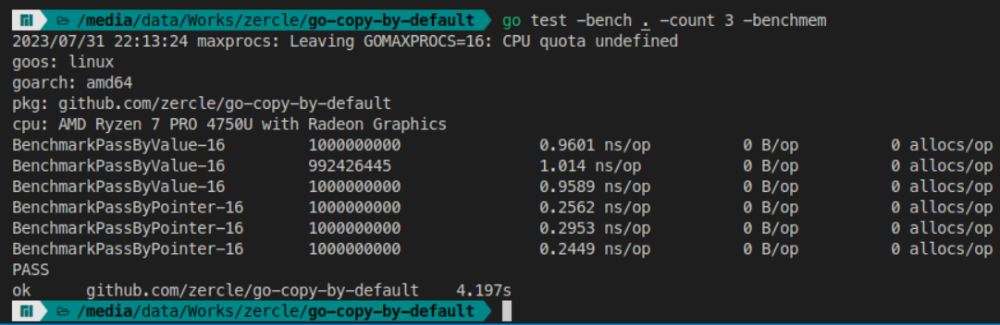
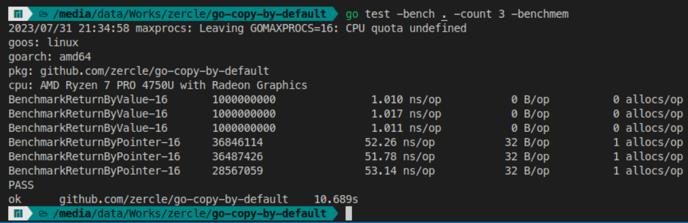
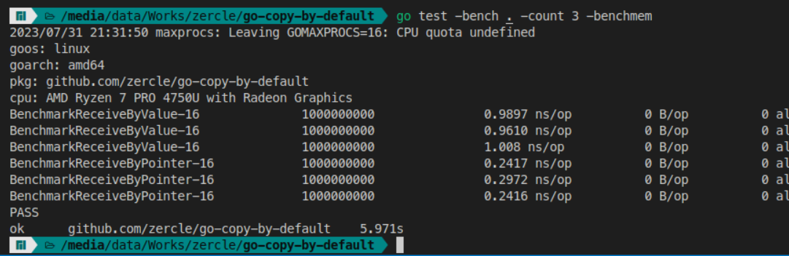
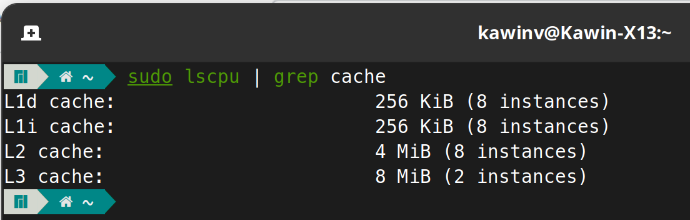

When writing Go, a question that always comes up is whether to use a value or a pointer for a function. Let's look at the difference.

<!--more-->

## tl;dr
Go is a copy-by-default language, so you can use pass-by-value as the default (with some exceptions, which will be explained below).

## Reviewing the basics

### stack
A stack is a data structure where elements are arranged in a last-in, first-out (LIFO) manner.

### heap
A heap is a priority-based data structure with the properties of a binary tree, making it more flexible than a stack for adding, removing, and accessing elements (but at the cost of access time).

### Summary
- A stack is fast but can only access the most recently added data.
- A heap is slower but can access any stored data at any time.

## Go is copy by default
From [stack_or_heap](https://go.dev/doc/faq#stack_or_heap) on the official Go website:

From a correctness standpoint, you don't need to know. Each variable in Go exists as long as there are references to it. The storage location chosen by the implementation is irrelevant to the semantics of the language.

The storage location does have an effect on writing efficient programs. When possible, the Go compilers will allocate variables that are local to a function in that function's stack frame. However, if the compiler cannot prove that the variable is not referenced after the function returns, then the compiler must allocate the variable on the garbage-collected heap to avoid dangling pointer errors. Also, if a local variable is very large, it might make more sense to store it on the heap rather than the stack.

In the current compilers, if a variable has its address taken, that variable is a candidate for allocation on the heap. However, a basic escape analysis recognizes some cases when such variables will not live past the return from the function and can reside on the stack.


In summary, the Go compiler will use the **stack** for `local variables` first. Any variable that cannot be identified as local or is a `pointer` will be on the **heap**.

## Common use cases

### pass to function
This is a common scenario where you pass a value to a function to do something and then it returns.
```go
func PassByValue(s SomeStruct) {
}

func PassByPointer(s *SomeStruct) {
}
```
Let's benchmark it.

As you can see, pass-by-value takes more time because it has to copy the value to the destination function, while a pointer doesn't need to copy data, so it's faster.

### return from function
Now, returning a value from a function can also be done in both ways.
```go
func ReturnByValue() SomeStruct {
	return SomeStruct{}
}

func ReturnByPointer() *SomeStruct {
	return &SomeStruct{}
}
```
Let's benchmark it.

This is very clear. Returning a pointer takes much less time per operation and also involves memory allocation. As recapped above, a value returned locally will use the stack, which is faster than the heap and doesn't require memory allocation.

### method receiver
This is a common scenario when defining a function for a type, and you can set the receiver in both ways.
```go
func (s SomeStruct) ReceiveByValue() SomeStruct {
  return s
}

func (s *SomeStruct) ReceiveByPointer() {
}
```
Let's benchmark it.

Here, a value receiver wastes time copying before calling the method, but a pointer receiver can call the method directly by referencing the memory address.

## When should you use a pointer?
- For a method receiver, as the name suggests, because of [Choosing a value or pointer receiver](https://go.dev/tour/methods/8)
  - A pointer allows the method to modify the value in the receiver.
  - It avoids copying the value every time the method is called.
- For a function that needs to use and modify the original value.
- For a struct that uses `sync.Mutex`, because the purpose is to have a lock during use to prevent data overwriting between goroutines.
- For a large struct ([how to calculate struct size]( "how to calculate struct size")). How large is large? Compare the size with the CPU's L2 cache. If it's larger, it's considered large (actually, trying to keep variables passed between each other within the size of the L1 cache will be very fast).
  - You can check the L cache size with `sudo lscpu | grep cache`. For example, on my machine, the L2 cache size is 512 KiB * 8 CPU Cores = 4MiB. Therefore, a struct larger than 512KiB should be a pointer (for my machine).



## When should you use a value?
- When it doesn't meet the conditions for **[When should you use a pointer?]( "When should you use a pointer?" )** **lol** just kidding.
- For general data types like `int`, `string`, `float`, etc.
- For a function return that is not used as a global variable, because if it's used as a local variable, it will use the value from the stack, which will be fast as benchmarked above.
- For a value passed to a function, because even though using a pointer is faster, the main drawback is that it's not concurrently safe. For example, if we pass a pointer to a function and another goroutine writes to the same pointer (race condition), the result will not be pretty.
- For other cases where you are not sure (because Go is a copy-by-default language).

## Special cases
- `map`, `slice`, `func`, `chan`, `interface` are all values that reference a pointer internally, so you can use them as values.

There are still many details in writing Go that I have encountered. I recommend that you read the documentation of the language you are using (not just Go), at least the effective guides for each language. Because if we write well according to the guidelines, not only will we not fall into anti-patterns, but we will also get good app performance and not waste resources on deploying our app for no reason (don't just blame the resources and scale up, look at yourself and see if you have written it well or not).
