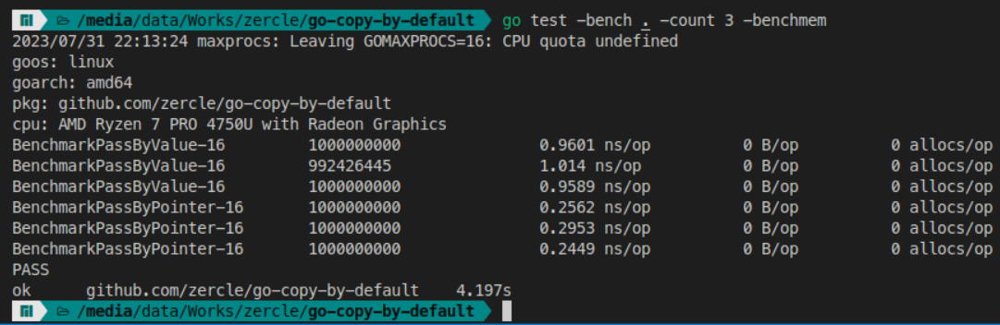
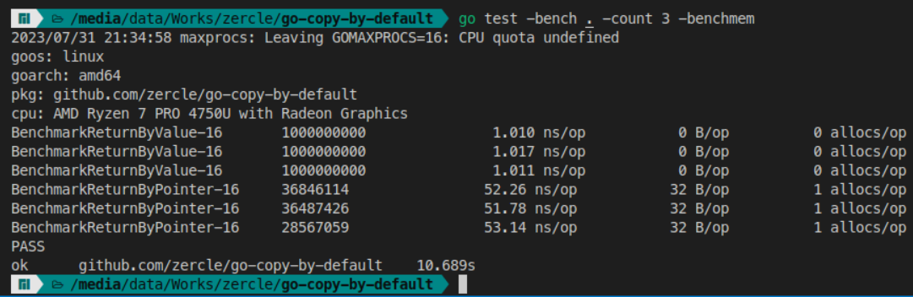
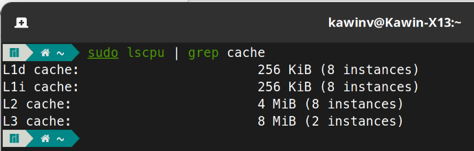

ในเวลาที่เขียนภาษา Go มักจะมีคำถามนึงโผล่มาเสมอ คือตกลง func นี้จะใช้ Value หรือ Pointer ดีนะ เดี๋ยวเรามาดูความแตกต่างกัน

<!--more-->

## tl;dr
Go เป็นภาษาที่ copy by default เพราะฉะนั้นใช้ pass by value เป็น default ได้เลย (ยกเว้น เคสบางอย่างซึ่งจะอธิบายต่อด้านล่างครับ)

## ทบทวนความรู้

### stack
คือ โครงสร้างข้อมูลแบบเรียงซ้อนต่อกันซึ่งเวลาทำงานมันก็ทำงานแบบ **มาทีหลัง ออกไปก่อน** (มันถึงได้ชื่อ stack แหละ)

### heap
คือ โครงสร้างข้อมูลแบบลำดับตามความสำคัญซึ่งมีคุณสมบัติของ binary tree ทำให้สามารถเพิ่มลด เรียกใช้งานได้ยืดหยุ่นกว่า stack (แต่ก็แลกมาด้วย access time ละนะ)

### สรุป
- stack เร็วแต่จะใช้ข้อมูลได้จากที่เพิ่มเข้าไปล่าสุดก่อน
- heap ช้ากว่าแต่ก็จะเรียกใช้ข้อมูลที่เก็บไว้ตอนไหนก็ได้

## Go copy by default
จาก [stack_or_heap](https://go.dev/doc/faq#stack_or_heap) ในเว็บหลักของ Go ระบุไว้แบบนี้
> From a correctness standpoint, you don't need to know. Each variable in Go exists as long as there are references to it. The storage location chosen by the implementation is irrelevant to the semantics of the language.
> 
> The storage location does have an effect on writing efficient programs. When possible, the Go compilers will allocate variables that are local to a function in that function's stack frame. However, if the compiler cannot prove that the variable is not referenced after the function returns, then the compiler must allocate the variable on the garbage-collected heap to avoid dangling pointer errors. Also, if a local variable is very large, it might make more sense to store it on the heap rather than the stack.
> 
> In the current compilers, if a variable has its address taken, that variable is a candidate for allocation on the heap. However, a basic escape analysis recognizes some cases when such variables will not live past the return from the function and can reside on the stack.

สรุปคือ Go compiler จะใช้ **stack** สำหรับ `local variable` ก่อน ส่วน variable ไหนที่ระบุไม่ได้ว่ามาจากไหนหรือเป็น `pointer` จะอยู่ใน **heap**

## การใช้งานที่เจอบ่อย ๆ

### pass to function
อันนี้ก็ท่าปกติที่จะเจอกันบ่อย ๆ คือ ส่งค่าเข้าไปทำอะไรสักอย่างใน function แล้วก็ออกมา
```go
func PassByValue(s SomeStruct) {
}

func PassByPointer(s *SomeStruct) {
}
```
benchmark ดูหน่อย

จะเห็นได้ว่า pass by value จะใช้เวลามากกว่า ก็เพราะว่าจะต้อง copy value ไปใช้ใน function ปลายทางแต่ pointer ไม่ต้องมีการ copy data ก็เลยไวกว่า

### return from function
ทีนี้การส่งค่าออกจาก function ก็สามารถส่งออกมาได้ทั้งสองแบบ
```go
func ReturnByValue() SomeStruct {
	return SomeStruct{}
}

func ReturnByPointer() *SomeStruct {
	return &SomeStruct{}
}
```
benchmark ดูหน่อย

อันนี้ ชัดเจนเลยว่า return pointer ใช้เวลาต่อ operation ต่างกันมาก แถมยังมีการจอง memory อีก ก็ตามที่ recap ไปด้านบนเลยว่าค่าที่ return กลับมาแบบ local จะใช้ stack ซึ่งเร็วกว่า heap และไม่ต้องจอง memory ด้วย

### method receiver
ท่านี้จะเจอในเวลาที่กำหนด function ให้ type ซึ่งก็สามารถตั้ง receiver ได้ทั้ง 2 แบบอีก
```go
func (s SomeStruct) ReceiveByValue() SomeStruct {
  return s
}

func (s *SomeStruct) ReceiveByPointer() {
}
```
benchmark ดูหน่อย

อันนี้ receiver แบบ value เสียเวลาไปกับการ copy ก่อนถึงจะเรียกใช้ method แต่ receiver แบบ pointer เรียกใช้ method ได้เลยจากการอ้าง memory address

## เมื่อไหร่ควรใช้ pointer
- method receiver ก็ตามชื่อเลยเหตุก็เพราะว่า [Choosing a value or pointer receiver
](https://go.dev/tour/methods/8)
  - pointer ทำให้ method สามารถแก้ไขค่าใน receiver ได้
  - เป็นการหลีกเลี่ยงการ copy value ทุกครั้งที่มีการเรียก method
- struct ที่ใช้ `sync.Mutex` เพราะเหตุที่ต้องการใช้งานก็เพื่อให้มีการ Lock ในระหว่างที่ใช้งานอยู่ ป้องกันการซ้อนทับของข้อมูลระหว่าง go routine
- struct ขนาดใหญ่ ส่วนเท่าไหร่ที่เรียกว่าใหญ่นั้น ก็เทียบขนาดกับ L2 cache ของ CPU ถ้าเกินก็ถือว่าใหญ่ (จริง ๆ พยายามให้ variable ที่ส่งระหว่างกันอยู่ในขนาดของ L1 ได้จะเร็วส์มาก)
  - ดูขนาด L cache ได้จาก `sudo lscpu | grep cache` ตัวอย่างจากเครื่องผมคือ L2 cache ขนาด 512 KiB * 8 CPU Cores = 4MiB เพราะฉะนั้น struct ที่เกิน 512KiB ก็ใช้เป็น pointer ไป (สำหรับเครื่องผมนะ)



## เมื่อไหร่ควรใช้ value
- เมื่อไม่ตรงกับเงื่อนไขของ **เมื่อไหร่ควรใช้ pointer** **ถถถ** หยอก ๆ
- พวก data type ทั่วไป เช่น `int`, `string`, `float` ฯลฯ
- function return ที่ไม่ได้ใช้งานระดับ global เพราะถ้าใช้งานระดับ local มันจะเป็นการใช้ค่าจาก stack ซึ่งก็จะเร็วตามที่ได้ benchmark ไปด้านบนละนะ
- ค่าที่ส่งเข้า function เพราะถึงแม้ว่าการใช้ pointer จะเร็วกว่า แต่ข้อเสียหลักเลยคือ มันไม่ concurrent safe ยกตัวอย่างถ้าเราส่ง pointer เข้าไปทำงานใน function แล้วดันมีอีก Go routine นึงมาเขียนข้อมูลทับไป (race condition) result ที่ได้ก็คงยิ้มไม่ออก
- อื่น ๆ ที่ไม่แน่ใจ (ก็เพราะ Go เป็นภาษาที่ copy by default ละนะ)

## เคสพิเศษ
- `map` `slice` `func` `chan` `interface` พวกนี้จะเป็น value ที่อ้างอิงไป pointer ในตัวอยู่แล้ว เวลาใช้ก็ใช้เป็น value ได้เลย

ทั้งนี้ยังมีรายละเอียดในการเขียน Go ที่เจอมาอีกเยอะ แนะนำว่าควรอ่าน Doc ของภาษาที่ใช้ (ไม่เฉพาะ Go นะ) อย่างน้อยก็ในส่วนที่เป็น Effective guides ของแต่ละภาษา เพราะถ้าเราเขียนออกมาดีตาม guideline นอกจากจะไม่เข้าสู่ anti pattern แล้ว ยังทำให้ได้ perfomance ของแอปออกมาดี ไม่ต้องเปลืองค่า resources ที่เอาแอปเราไป deploy โดยใช่เหตุอีกด้วย (ไม่ใช่เอะอะก็โทษ resources ไม่พอต้อง scale up อย่างเดียว กลับมาดูตัวเราเองด้วยว่า เขียนดีแล้วหรือยัง)