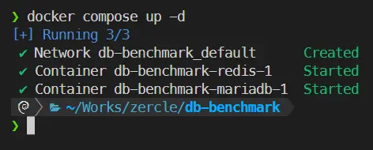
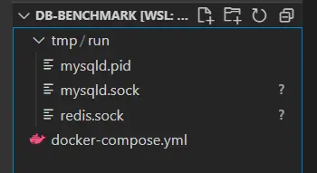
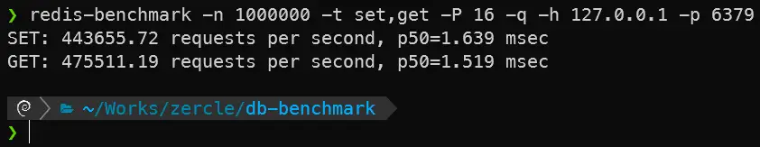
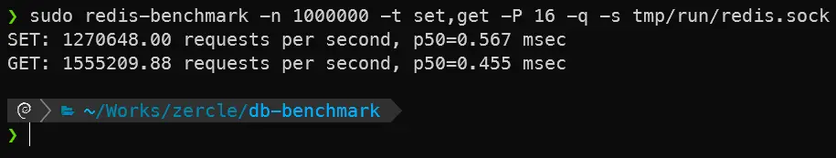
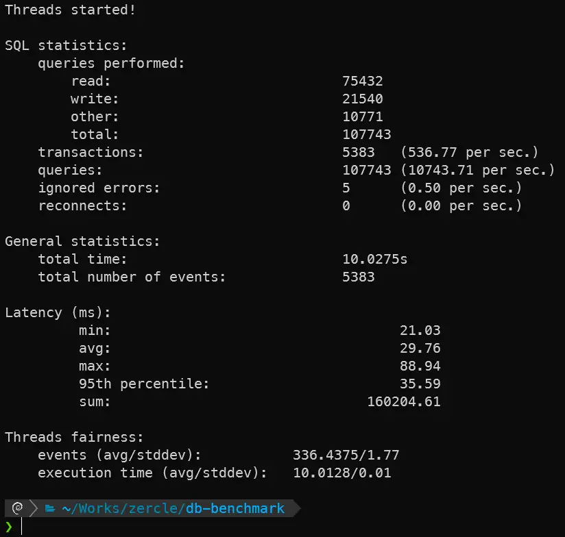
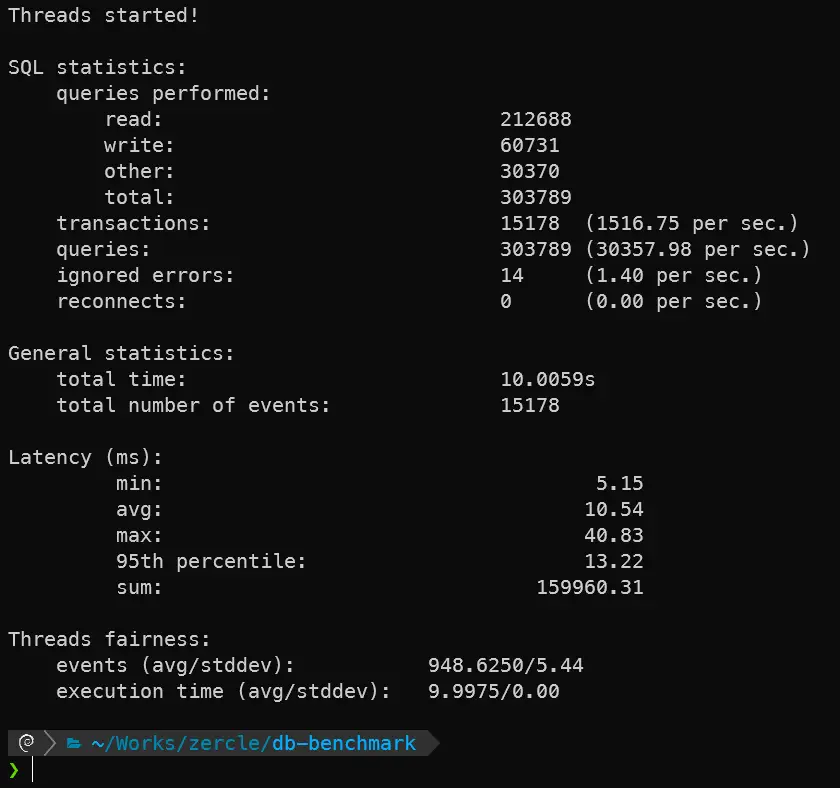

Normally, when using a database for small-scale tasks in a container, we usually connect via TCP/IP, right? But did you know that you can easily improve performance by removing the TCP overhead by using Unix sockets instead? Let's see what the results are.

<!--more-->

## `docker-compose.yml`
Let's start by spinning up a database in Docker using Docker Compose, keeping it as default as possible, as shown below:
```yaml
x-default: &deafult-env
  TZ: Asia/Bangkok
x-mariadb: &mariadb-env
  MARIADB_ALLOW_EMPTY_ROOT_PASSWORD: true
  MARIADB_AUTO_UPGRADE: true

services:
  mariadb:
    image: mariadb:lts
    environment:
      <<: [*deafult-env, *mariadb-env]
    volumes:
      - mariadb_data:/var/lib/mysql
      - ./tmp/run:/run/mysqld
    ports:
      - 3306:3306

  redis:
    image: redis:alpine
    environment:
      <<: [*deafult-env]
    volumes:
      - redis_data:/data
      - ./tmp/run:/data/run
    command: [
        "redis-server",
        "--unixsocket /data/run/redis.sock",
      ]
    ports:
      - 6379:6379

volumes:
  mariadb_data:
  redis_data:
```

After `docker compose up -d`, it will look something like this:

Unix socket files:


## Redis
Let's start with the fastest and simplest database in the example. We will test read and write operations.

### TCP/IP

```bash
redis-benchmark -n 1000000 -t set,get -P 16 -q -h 127.0.0.1 -p 6379
```

Results:


### UNIX socket

```bash
redis-benchmark -n 1000000 -t set,get -P 16 -q -s tmp/run/redis.sock
```

Results:


## MariaDB
Next, let's test a popular database. We will test read and write operations as before.

### Prepare data for testing
First, create a database and table for sysbench.
```bash
sysbench oltp_read_write --db-driver=mysql --mysql-host=127.0.0.1 --mysql-user=root --mysql-db=sysbenchtest --threads=16 prepare
```

### TCP/IP

```bash
sysbench oltp_read_write --db-driver=mysql --mysql-host=127.0.0.1 --mysql-user=root --mysql-db=sysbenchtest --threads=16 run
```

Results:


### UNIX socket

```bash
sysbench oltp_read_write --db-driver=mysql --mysql-socket=tmp/run/mysqld.sock --mysql-user=root --mysql-db=sysbenchtest --threads=16 run
```

Results:


## Conclusion

|                    | **read (req/s)** | **write (req/s)** | **latency avg (ms)** |
|--------------------|------------------|-------------------|----------------------|
| Redis TCP          | 475,511.19       | 443,655.72        | 1.519 / 1.639        |
| Redis UnixSocket   | 1,555,209.88     | 1,270,648.00      | 0.455 / 0.567        |
| MariaDB TCP        | 75,432           | 21,540            | 29.76                |
| MariaDB UnixSocket | 212,688          | 60,731            | 10.54                |

As you can see, by reducing the overhead of TCP and using Unix sockets instead, we can handle a much higher load without having to significantly scale up our resources. Or, in Kubernetes workloads with sidecars, you can use Unix sockets for inter-process communication instead of TCP/IP.
> Note: This only works on nodes that share the same volume.
